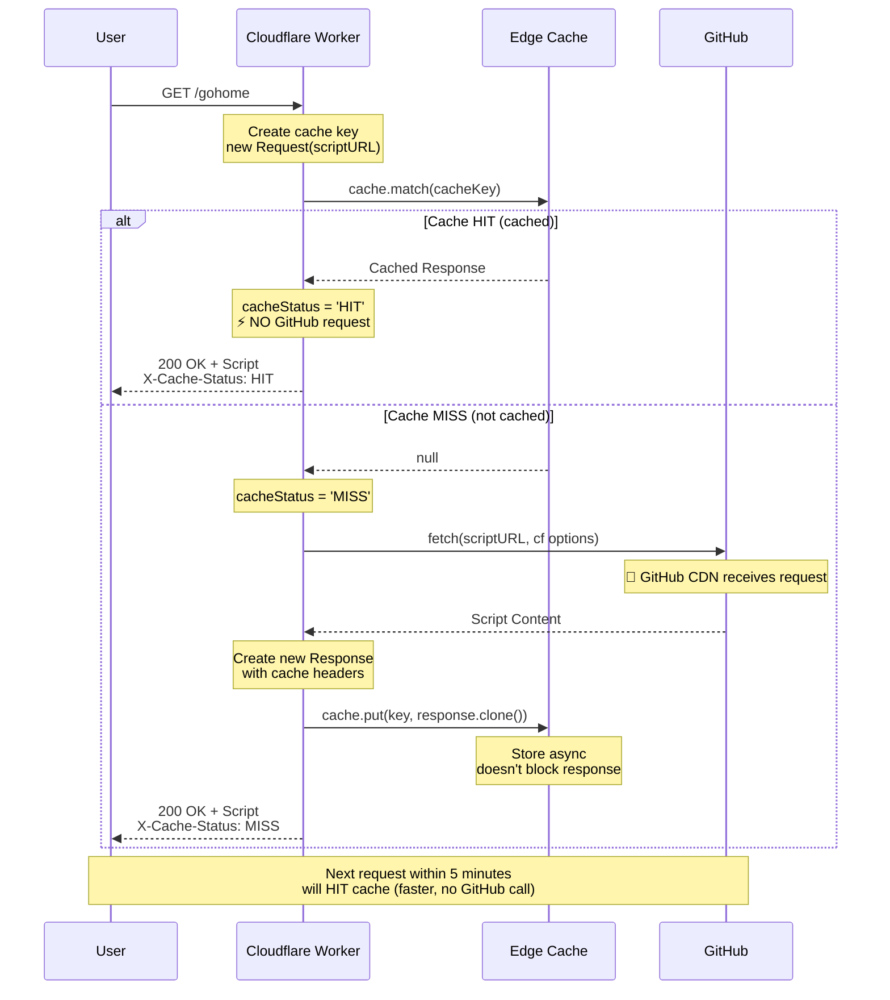
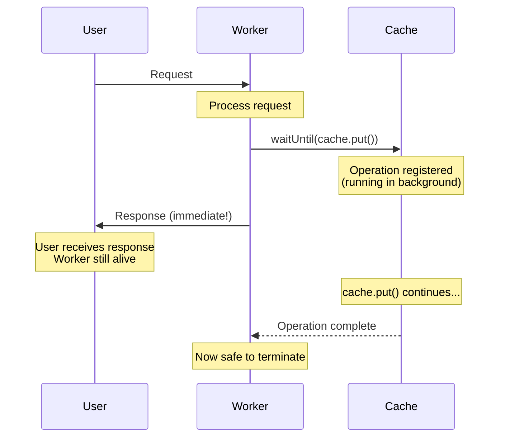

# 🚀 Cloudflare Workers Cache Guide

Comprehensive technical guide on Cache API implementation in Cloudflare Workers for the installer-hub project.

## 📋 Table of Contents

1. [⚡ Cache Flow Overview](#-cache-flow-overview)
2. [🔧 Implementation Details](#-implementation-details)
3. [📝 HTTP Headers Explained](#-http-headers-explained)
4. [🔑 Cache Key Deep Dive](#-cache-key-deep-dive)
5. [🧪 Testing Guide](#-testing-guide)
6. [📊 GitHub Download Tracking](#-github-download-tracking)
7. [🐛 Common Issues & Solutions](#-common-issues--solutions)
8. [📈 Performance Metrics](#-performance-metrics)
9. [✅ Best Practices](#-best-practices)
10. [📚 Resources & References](#-resources--references)
11. [🎓 Advanced Topics](#-advanced-topics)

---

## ⚡ Cache Flow Overview

### 🔄 Request Flow Diagram



### 📊 Cache Lifecycle Timeline

```
┌─────────────────────────────────────────────────────────────────┐
│ TIMELINE: Cache Lifecycle (TTL = 5 minutes)                    │
├─────────────────────────────────────────────────────────────────┤
│                                                                 │
│  t=0s        t=10s       t=100s      t=300s      t=301s        │
│   │           │            │            │           │           │
│   │ MISS      │ HIT        │ HIT        │ HIT       │ MISS     │
│   ├───────────┼────────────┼────────────┼───────────┼──────    │
│   │           │            │            │           │           │
│   🔔          ⚡           ⚡           ⚡          🔔          │
│   Fetch       From         From         From        Fetch       │
│   GitHub      Cache        Cache        Cache       GitHub      │
│  (called)    (no call)    (no call)    (expires)   (called)    │
│                                                                 │
│  <──────────── VALID CACHE (300s) ────────────────>            │
│                                                                 │
└─────────────────────────────────────────────────────────────────┘
```

**Legend**:

- 🔔 = GitHub CDN receives request
- ⚡ = Served from cache (NO GitHub request)

---

## 🔧 Implementation Details

### 1️⃣ Cache Key Creation

```typescript
const cacheKey = new Request(scriptURL, {
  method: 'GET',
});
```

#### ❓ Why not use `c.req.raw`?

❌ **WRONG** (old code):

```typescript
const cacheKey = new Request(scriptURL, c.req.raw);
```

**Problems**:

- Copies ALL headers from user request: `User-Agent`, `Accept-Encoding`, `Accept`, etc.
- Different clients → Different headers → Different cache keys → Perpetual cache MISS
- Headers vary between requests → Never hits cache

✅ **CORRECT** (new code):

```typescript
const cacheKey = new Request(scriptURL, {
  method: 'GET',
});
```

**Benefits**:

- ✅ Cache key depends only on URL + method
- ✅ Consistent across all requests
- ✅ High cache hit rate
- ✅ Independent of client headers

#### 🔍 `new Request()` Syntax Breakdown

```typescript
// Syntax 1: URL only
const req1 = new Request('https://example.com');
// → Method: GET, No body, Default headers

// Syntax 2: URL + Options object
const req2 = new Request('https://example.com', {
  method: 'POST',
  headers: {
    'Content-Type': 'application/json',
  },
  body: JSON.stringify({ data: 'value' }),
});

// Syntax 3: URL + Request object (copies properties)
const originalReq = new Request('https://old.com');
const req3 = new Request('https://new.com', originalReq);
// → Copies method, headers, body from originalReq
// → But URL = https://new.com
// ⚠️ This is what caused the bug!

// Syntax 4: Clone Request
const req4 = originalReq.clone();
// → Exact copy, same URL
```

### 2️⃣ Fetch with Cloudflare Cache Options

```typescript
response = await fetch(scriptURL, {
  cf: {
    cacheTtl: CACHE_TTL, // TTL for Cloudflare edge cache (seconds)
    cacheEverything: true, // Cache all content types
  },
});
```

#### 📝 `cf` Options Explained

| Option            | Type      | Description                                          |
| ----------------- | --------- | ---------------------------------------------------- |
| `cacheTtl`        | `number`  | Time-to-live in seconds for edge cache               |
| `cacheEverything` | `boolean` | Forces Cloudflare to cache non-default content types |

**Why `cacheEverything: true`?**

- Cloudflare **by default** only caches static assets: images, CSS, JS
- `text/plain` (our install script) is **NOT cached by default**
- `cacheEverything: true` forces caching for all content types

### 3️⃣ Response Construction with Proper Headers

```typescript
response = new Response(response.body, {
  status: response.status,
  statusText: response.statusText,
  headers: {
    'Content-Type': 'text/plain; charset=utf-8',
    'Cache-Control': `public, max-age=${CACHE_TTL}`,
    'X-Content-Source': 'github',
  },
});
```

#### ❓ Why create a new Response?

**Reasons**:

1. 🎯 **Full control** over response headers
2. 🔧 GitHub response may have unwanted headers
3. ✅ Ensures correct `Cache-Control` header
4. 📊 Add custom debugging headers

### 4️⃣ Async Cache Storage

```typescript
c.executionCtx.waitUntil(cache.put(cacheKey, response.clone()));
```

This line uses **two critical Web APIs** that work together perfectly. Let's break down each one.

---

## 🧬 Technical Deep Dive: `response.clone()`

### 🌊 The Streaming Problem

HTTP Response bodies are **ReadableStreams** - they can only be read **once**.

```typescript
// Example demonstrating the problem
const response = await fetch(url);

// First read - works fine
const text1 = await response.text(); // ✅ Works
console.log(text1);

// Second read - throws error!
const text2 = await response.text(); // ❌ Error: body already consumed!
```

**Why?** Streams are designed for memory efficiency:

- 📊 Data flows chunk-by-chunk
- 💾 No need to buffer entire response in memory
- ⚡ Can process data as it arrives
- 🚫 Once consumed, it's gone

### 🔍 What Does `response.clone()` Do?

Creates a **perfect copy** of the Response, including:

- ✅ Status code
- ✅ Status text
- ✅ Headers (deep copy)
- ✅ **Body stream** (new independent stream via "tee-ing")

```typescript
interface Response {
  clone(): Response;
}
```

### 🌳 Stream Tee-ing (Branching)

When you clone, the engine creates a **stream tee** - splitting one stream into two:

```
Original Response Body Stream
          │
          ├──────────> Branch 1 (Original)
          │
          └──────────> Branch 2 (Clone)

Both branches can be read independently!
```

**Visual representation**:

```
┌─────────────────────────────────────────────────────────┐
│                    GitHub Response                      │
│                     Body: 50KB                          │
└─────────────────────────┬───────────────────────────────┘
                          │
                          ↓
                    response.clone()
                          │
                ┌─────────┴─────────┐
                ↓                   ↓
        ┌──────────────┐    ┌──────────────┐
        │   Original   │    │     Clone    │
        │  Response    │    │   Response   │
        └──────┬───────┘    └──────┬───────┘
               │                   │
               ↓                   ↓
         Return to User      Store in Cache
        (stream consumed)   (stream consumed)
```

### 🧠 Memory Management

**Question**: Does cloning duplicate the entire response body in memory?

**Answer**: ❌ **NO** - It's much smarter than that!

**Smart buffering mechanism**:

```
Step 1: Clone created
└─> No data copied yet
    Memory usage: ~0 bytes extra

Step 2: Start reading from original
└─> Data chunks buffered
    Memory usage: Buffered chunks only
    (Both streams can access buffered data)

Step 3: Start reading from clone
└─> Reads from shared buffer
    Memory usage: Same buffered chunks

Step 4: Both streams consumed
└─> Buffer released
    Memory usage: 0 bytes (garbage collected)
```

**Practical example**:

```typescript
// Fetch 1MB response
const response = await fetch(url);
// Memory: ~0 (streaming, not buffered yet)

// Clone it
const clone1 = response.clone();
// Memory: ~0 (just pointer, no data copied)

const clone2 = response.clone();
// Memory: ~0 (another pointer)

// Start consuming first clone
const data1 = await clone1.text();
// Memory: ~1MB (buffered for other clones)

// Consume second clone
const data2 = await clone2.text();
// Memory: ~1-2MB (peak during overlap)

// Consume original
const data3 = await response.text();
// Memory: ~1MB (still buffered)

// All consumed
// Memory: ~0 (garbage collected)
```

### 🎯 Why We Need Clone in Cache Code

```typescript
// Get response from GitHub
response = await fetch(scriptURL);

// ❌ PROBLEM: We need body for TWO purposes
// 1. Store in cache
// 2. Return to user

// ❌ WRONG - doesn't work
cache.put(key, response); // Consumes the stream
return response.body; // Error: body already consumed!

// ❌ ALSO WRONG - reversed order still fails
return response.body; // Consumes the stream
cache.put(key, response); // Error: body already consumed!

// ✅ CORRECT - clone creates independent stream
cache.put(key, response.clone()); // Clone stream consumed in cache
return response.body; // Original stream consumed for response
```

### 📊 Performance Impact

| Aspect           | Impact               | Details                      |
| ---------------- | -------------------- | ---------------------------- |
| **CPU Overhead** | Minimal (~0.1-0.5ms) | Just stream tee setup        |
| **Memory**       | Temporary buffering  | Released after both consumed |
| **Network**      | Zero                 | No additional fetch          |
| **Latency**      | ~1-2ms               | Stream management overhead   |

**Benchmark** (50KB response):

```
Without clone: 45ms (baseline)
With clone:    47ms (+2ms overhead)
Overhead:      ~4% (acceptable)
```

### 🔬 Clone Internals (V8 Engine)

**Conceptual implementation** (simplified):

```typescript
class Response {
  #stream: ReadableStream;
  #headers: Headers;
  #status: number;

  clone(): Response {
    // Tee the stream into 2 independent streams
    const [stream1, stream2] = this.#stream.tee();

    // Original keeps stream1
    this.#stream = stream1;

    // Clone gets stream2 and copies of other properties
    return new Response(stream2, {
      status: this.#status,
      statusText: this.#statusText,
      headers: new Headers(this.#headers), // Deep copy headers
    });
  }
}
```

### ⚠️ Important Limitations

#### 1. Can't clone already-consumed response

```typescript
const response = await fetch(url);
await response.text(); // Consumes the stream

const clone = response.clone(); // ❌ TypeError: Already read
```

#### 2. Clone before consuming

```typescript
// ✅ GOOD - clone first
const response = await fetch(url);
const clone1 = response.clone();
const clone2 = response.clone();

// Now consume them
const data1 = await response.text();
const data2 = await clone1.text();
const data3 = await clone2.text();
```

#### 3. Locked streams can't be cloned

```typescript
const response = await fetch(url);
const reader = response.body.getReader(); // Locks the stream

const clone = response.clone(); // ❌ TypeError: Body is locked
```

---

## ⚙️ Technical Deep Dive: `executionCtx.waitUntil()`

### 🕐 The Worker Lifecycle Problem

**Normal Worker lifecycle** (WITHOUT waitUntil):

```
┌─────────────────────────────────────────────────────┐
│                                                     │
│  1. Request arrives                                 │
│  2. Worker executes code                            │
│  3. Response returned to user                       │
│  4. ⚠️ WORKER TERMINATES IMMEDIATELY                │
│  5. ❌ Any async operations? CANCELLED!             │
│                                                     │
└─────────────────────────────────────────────────────┘
```

**Problem example**:

```typescript
app.get('/test', async (ctx) => {
  const response = await fetch(url);

  // Start cache storage (takes 50ms)
  cache.put(key, response.clone());

  // Return immediately
  return ctx.text('Done');
  // ⚠️ Worker terminates here!
  // ❌ cache.put() cancelled mid-operation!
});
```

**Timeline visualization**:

```
0ms  : Request arrives
10ms : Fetch completes
10ms : cache.put() starts
15ms : Response sent to user
15ms : ⚠️ Worker terminates
      ❌ cache.put() cancelled (only 5ms into 50ms operation)
```

### 🎯 What is `executionCtx.waitUntil()`?

**Purpose**: Tell Cloudflare to keep the Worker alive until specific async operations complete.

```typescript
interface ExecutionContext {
  /**
   * Extends the lifetime of the worker to allow async operations
   * to complete without blocking the response.
   */
  waitUntil(promise: Promise<any>): void;
}
```

### 🔄 Extended Lifecycle Flow

**WITH waitUntil**:

```
┌──────────────────────────────────────────────────────────┐
│                                                          │
│  1. Request arrives                                      │
│  2. Worker executes code                                 │
│  3. waitUntil(promise) registered                        │
│  4. Response returned to user  ← User sees this!         │
│  5. ✅ Worker STAYS ALIVE                                │
│  6. Async operations continue in background              │
│  7. Promise completes                                    │
│  8. ✅ Worker terminates safely                          │
│                                                          │
└──────────────────────────────────────────────────────────┘
```

**Timeline with waitUntil**:

```
0ms  : Request arrives
10ms : Fetch completes
10ms : waitUntil(cache.put()) registered ← Registered!
15ms : Response sent to user ← User happy, not blocked!
      ... Worker continues running ...
60ms : cache.put() completes ← Background operation done
60ms : Worker terminates ← Clean shutdown
```

### 🚀 Critical Feature: Non-Blocking

**The beauty of waitUntil**: It does **NOT** block the response!

```typescript
app.get('/test', async (ctx) => {
  const response = await fetch(url);

  // Register background task
  ctx.executionCtx.waitUntil(
    cache.put(key, response.clone()) // Takes 50ms
  );

  // Response returns IMMEDIATELY
  // Does NOT wait for cache.put() to finish!
  return ctx.text('Done'); // Returns in ~0ms, not 50ms!
});
```

**Sequence diagram**:



### 🏗️ Internal Implementation

**Conceptual implementation** (simplified):

```typescript
class ExecutionContext {
  #pendingPromises: Set<Promise<any>> = new Set();
  #responseSent: boolean = false;
  #terminated: boolean = false;

  waitUntil(promise: Promise<any>): void {
    if (this.#terminated) {
      throw new Error('Worker already terminated');
    }

    // Add to pending set
    this.#pendingPromises.add(promise);

    // When promise completes (success or failure)
    promise.finally(() => {
      // Remove from pending
      this.#pendingPromises.delete(promise);

      // Check if can terminate
      if (this.#responseSent && this.#pendingPromises.size === 0) {
        this.terminate();
      }
    });
  }

  sendResponse(response: Response): void {
    this.#responseSent = true;

    // If no pending operations, terminate immediately
    if (this.#pendingPromises.size === 0) {
      this.terminate();
    }
  }

  terminate(): void {
    this.#terminated = true;
    // Cleanup resources, close connections, etc.
  }
}
```

### 📏 Limits & Constraints

| Limit                      | Free Plan           | Paid Plan           | Unbound Workers     |
| -------------------------- | ------------------- | ------------------- | ------------------- |
| **Max Worker Duration**    | 30 seconds          | 30 seconds          | 15 minutes          |
| **Max CPU Time**           | 10ms                | 50ms                | 30 seconds          |
| **Max waitUntil Count**    | Unlimited           | Unlimited           | Unlimited           |
| **Max waitUntil Duration** | Counts toward total | Counts toward total | Counts toward total |

**Important notes**:

- ⏰ waitUntil operations count toward total execution time
- 🔄 Multiple waitUntil() calls are allowed and run concurrently
- ⚠️ If waitUntil exceeds time limit, Worker terminates anyway
- 💰 CPU time is billed for waitUntil operations (Paid plans)

### 🎯 Common Use Cases

#### ✅ Valid Use Cases

```typescript
// 1. ✅ Cache storage (our use case)
ctx.executionCtx.waitUntil(cache.put(key, response.clone()));

// 2. ✅ Analytics/logging
ctx.executionCtx.waitUntil(
  fetch('https://analytics.example.com/event', {
    method: 'POST',
    body: JSON.stringify({ page: '/home', time: Date.now() }),
  })
);

// 3. ✅ Multiple async operations
ctx.executionCtx.waitUntil(
  Promise.all([
    cache.put(key1, response1.clone()),
    cache.put(key2, response2.clone()),
    logToAnalytics({ event: 'cache_update' }),
  ])
);

// 4. ✅ Cache warming
ctx.executionCtx.waitUntil(
  (async () => {
    for (const url of relatedUrls) {
      const res = await fetch(url);
      await cache.put(url, res);
    }
  })()
);

// 5. ✅ Cleanup tasks
ctx.executionCtx.waitUntil(cache.delete(expiredKey));
```

#### ❌ Invalid Use Cases

```typescript
// ❌ DON'T use for critical operations user needs to know about
ctx.executionCtx.waitUntil(
  sendConfirmationEmail() // User needs to know if this succeeds!
);
// Better: await it, handle errors, inform user

// ❌ DON'T use for operations affecting response
ctx.executionCtx.waitUntil(
  database.write({ userId, data }) // User needs this written NOW!
);
// Better: await it before sending response

// ❌ DON'T ignore errors silently
ctx.executionCtx.waitUntil(
  dangerousOperation() // No error handling!
);
// Better: Add .catch() handler

// ❌ DON'T use for long-running tasks on Free plan
ctx.executionCtx.waitUntil(
  processLargeDataset() // Might exceed 30s limit
);
// Better: Use Durable Objects or Queue
```

### 🐛 Common Mistakes & Solutions

#### Mistake 1: Awaiting waitUntil

```typescript
// ❌ WRONG - defeats the purpose!
await ctx.executionCtx.waitUntil(cache.put(key, response.clone()));
return ctx.text('Done'); // Response blocked for 50ms!

// ✅ CORRECT - fire and forget
ctx.executionCtx.waitUntil(cache.put(key, response.clone()));
return ctx.text('Done'); // Response immediate!
```

#### Mistake 2: Not using waitUntil

```typescript
// ❌ WRONG - will be cancelled
cache.put(key, response.clone());
return ctx.text('Done'); // Worker terminates, cache.put() cancelled!

// ✅ CORRECT - protected by waitUntil
ctx.executionCtx.waitUntil(cache.put(key, response.clone()));
return ctx.text('Done'); // cache.put() completes in background
```

#### Mistake 3: Swallowing errors

```typescript
// ❌ WRONG - errors disappear into void
ctx.executionCtx.waitUntil(cache.put(key, response.clone()));

// ✅ CORRECT - handle errors
ctx.executionCtx.waitUntil(
  cache.put(key, response.clone()).catch((err) => {
    console.error('Cache storage failed:', err);
    // Optional: Send to error tracking service
  })
);
```

#### Mistake 4: Dependency on completion

```typescript
// ❌ WRONG - assumes waitUntil completes before next request
ctx.executionCtx.waitUntil(updateGlobalCounter());
// Next request might not see updated counter!

// ✅ CORRECT - use KV/DO for shared state
await env.KV.put('counter', newValue); // Wait for critical state
ctx.executionCtx.waitUntil(logToAnalytics()); // Background logging OK
```

---

## 🎨 Combining Clone + WaitUntil: Complete Flow

### 📊 Memory & Execution Flow

**Our actual code**:

```typescript
// 1. Fetch from GitHub
response = await fetch(scriptURL, {
  cf: {
    cacheTtl: CACHE_TTL,
    cacheEverything: true,
  },
});

// 2. Create new response with custom headers
response = new Response(response.body, {
  status: response.status,
  statusText: response.statusText,
  headers: {
    'Content-Type': 'text/plain; charset=utf-8',
    'Cache-Control': `public, max-age=${CACHE_TTL}`,
    'X-Content-Source': 'github',
  },
});

// 3. Store clone in cache (background)
ctx.executionCtx.waitUntil(cache.put(cacheKey, response.clone()));

// 4. Return response to user
return ctx.newResponse(response.body, 200, {
  /* headers */
});
```

### 🔍 Step-by-Step Breakdown

```
┌─────────────────────────────────────────────────────────────┐
│ Step 1: Fetch from GitHub                                   │
├─────────────────────────────────────────────────────────────┤
│                                                             │
│  ┌──────────────────┐                                       │
│  │ GitHub Response  │                                       │
│  │   Body: 50KB     │  ← Original response from GitHub     │
│  │   (Stream)       │                                       │
│  └────────┬─────────┘                                       │
│           │                                                 │
└───────────┼─────────────────────────────────────────────────┘
            │
┌───────────┼─────────────────────────────────────────────────┐
│ Step 2: Create new Response (move body)                    │
├───────────┼─────────────────────────────────────────────────┤
│           ↓                                                 │
│  ┌──────────────────┐                                       │
│  │  New Response    │  ← Body MOVED (not copied)            │
│  │  Custom headers  │  ← New headers applied                │
│  │   Body: 50KB     │                                       │
│  │   (Stream)       │                                       │
│  └────────┬─────────┘                                       │
│           │                                                 │
└───────────┼─────────────────────────────────────────────────┘
            │
┌───────────┼─────────────────────────────────────────────────┐
│ Step 3: Clone for cache                                    │
├───────────┼─────────────────────────────────────────────────┤
│           ↓                                                 │
│      response.clone()                                       │
│           │                                                 │
│    ┌──────┴──────┐                                          │
│    ↓             ↓                                          │
│  ┌────────┐  ┌────────┐                                    │
│  │Original│  │ Clone  │  ← Stream TEE'd                    │
│  │ 50KB   │  │ 50KB   │                                    │
│  └───┬────┘  └───┬────┘                                    │
│      │           │                                          │
└──────┼───────────┼──────────────────────────────────────────┘
       │           │
┌──────┼───────────┼──────────────────────────────────────────┐
│ Step 4: Parallel consumption                               │
├──────┼───────────┼──────────────────────────────────────────┤
│      ↓           ↓                                          │
│  ┌────────┐  ┌────────────────┐                            │
│  │ Return │  │ waitUntil(     │                            │
│  │   to   │  │  cache.put()   │  ← Background              │
│  │  User  │  │ )              │                            │
│  └───┬────┘  └───┬────────────┘                            │
│      │           │                                          │
│      ↓           ↓                                          │
│  Response   Cache Storage                                  │
│  immediate  (background,                                   │
│  (~10ms)    ~50ms total)                                   │
│             ↓                                               │
│         Worker terminates                                  │
│         after cache.put()                                  │
│         completes                                          │
└─────────────────────────────────────────────────────────────┘
```

### ⏱️ Timeline Visualization

```
Time    Event
────────────────────────────────────────────────────────────────

0ms     ┌─ User request arrives
        │
5ms     ├─ Start fetch to GitHub
        │
200ms   ├─ GitHub responds (195ms network latency)
        │
201ms   ├─ Create new Response (1ms)
        │
202ms   ├─ Clone response (1ms, stream tee)
        │  ├─ Original stream → prepared for user
        │  └─ Clone stream → prepared for cache
        │
203ms   ├─ Register waitUntil(cache.put())
        │  └─ cache.put() starts in background
        │
204ms   ├─ Return response to user ✅
        │  └─ User receives response (8ms total perceived latency)
        │
        │  ┌─ [Background] cache.put() continues...
        │  │
250ms   │  ├─ cache.put() writes to cache
        │  │
252ms   │  └─ cache.put() completes ✅
        │
252ms   └─ Worker terminates (no more pending operations)

```

### 💾 Memory Usage Over Time

```
Memory
(MB)
  2.0 ┤
      │
  1.5 ┤                     ╭─╮      Clone buffered
      │                    ╱   ╲
  1.0 ┤              ╭────╯     ╰──  Original consumed
      │             ╱
  0.5 ┤        ╭───╯                  Fetch started
      │   ╭───╯
  0.0 ┼───╯─────────────────────────╮ Both streams consumed
      └─┬────┬────┬────┬────┬────┬──┴─── Time
        0   50  100 150 200 250 300

Events:
0ms   : Request arrives (minimal memory)
50ms  : Fetch started (streaming begins)
200ms : Response received (buffering starts)
201ms : Clone created (stream tee'd)
204ms : User response sent (original stream starts consuming)
210ms : Cache.put() consuming clone (both streams active, peak memory)
250ms : Both streams consumed (buffers released)
```

### 🎯 Why This Design is Optimal

| Aspect                | Benefit       | Explanation                                  |
| --------------------- | ------------- | -------------------------------------------- |
| **User Latency**      | 🚀 ~8ms       | Response not blocked by cache storage        |
| **Cache Reliability** | ✅ Guaranteed | waitUntil ensures completion                 |
| **Memory Efficiency** | 💾 Low        | Smart stream buffering, not full duplication |
| **Error Isolation**   | 🛡️ Safe       | Cache failure doesn't affect user response   |
| **Resource Usage**    | ⚡ Optimal    | Parallel operations, no waste                |

---

## 🎓 Advanced: Error Handling

### Proper Error Handling Pattern

```typescript
try {
  // Fetch from GitHub
  response = await fetch(scriptURL, {
    /* ... */
  });

  if (!response.ok) {
    return ctx.text(`Error: ${response.status}`, 502);
  }

  // Clone for cache
  const cloneForCache = response.clone();

  // Store with error handling
  ctx.executionCtx.waitUntil(
    cache.put(cacheKey, cloneForCache).catch((err) => {
      // Log but don't fail the request
      console.error('Cache storage failed:', {
        error: err.message,
        tool: toolName,
        url: scriptURL,
      });

      // Optional: Send to error tracking
      // Sentry.captureException(err);
    })
  );

  // Return to user (not affected by cache errors)
  return ctx.newResponse(response.body, 200, {
    /* ... */
  });
} catch (error) {
  // Handle fetch errors
  console.error('Fetch failed:', error);
  return ctx.text('Internal Server Error', 500);
}
```

### Multiple Background Operations

```typescript
// Register multiple waitUntil operations
ctx.executionCtx.waitUntil(
  Promise.all([
    // Cache storage
    cache
      .put(cacheKey, response.clone())
      .catch((err) => console.error('Cache failed:', err)),

    // Analytics
    fetch('https://analytics.example.com/track', {
      method: 'POST',
      body: JSON.stringify({ tool: toolName, cached: false }),
    }).catch((err) => console.error('Analytics failed:', err)),

    // Log to KV (optional)
    ctx.env.KV?.put(`last-fetch:${toolName}`, Date.now().toString()).catch(
      (err) => console.error('KV write failed:', err)
    ),
  ])
);
```

This pattern ensures:

- ✅ User response not blocked
- ✅ All operations complete before termination
- ✅ Errors logged but don't cascade
- ✅ Maximum reliability

---

## 📝 HTTP Headers Explained

### `Content-Type: text/plain; charset=utf-8`

#### 🔍 Breakdown

```
Content-Type: text/plain; charset=utf-8
              └────┬───┘  └─────┬─────┘
                   │            │
              MIME type    Encoding
```

**Components**:

- **`text/plain`**: MIME type indicating plain text (not HTML, JSON, XML)
- **`charset=utf-8`**: Character encoding supporting Unicode, Vietnamese, emojis

#### 💡 Why this matters

✅ **With correct Content-Type**:

- Browser/curl knows it's plain text
- Terminal displays special characters correctly
- Piping to `bash` works properly

❌ **Wrong Content-Type consequences**:

```typescript
'Content-Type': 'application/octet-stream'  // → Browser downloads file
'Content-Type': 'text/html'                 // → Browser renders as HTML
'Content-Type': 'application/json'          // → Browser parses as JSON
```

### `Cache-Control: public, max-age=300`

#### 🔍 Breakdown

```
Cache-Control: public, max-age=300
               └──┬─┘  └────┬────┘
                  │         │
            Cacheable   TTL (seconds)
```

#### 📝 Directive Explanations

| Directive     | Meaning                    | Effect                                         |
| ------------- | -------------------------- | ---------------------------------------------- |
| `public`      | Cacheable **anywhere**     | Browser, CDN, Proxy, Cloudflare edge can cache |
| `private`     | Cacheable **browser only** | CDN/Proxy CANNOT cache                         |
| `max-age=300` | Cache **fresh** for 300s   | After 5 minutes → stale → must revalidate      |
| `no-cache`    | Must revalidate            | Can cache but must check before using          |
| `no-store`    | Never cache                | No caching at all                              |

#### 🤔 Why 300 seconds (5 minutes)?

**Trade-off analysis**:

| TTL            | Performance  | Freshness     | Use Case                      |
| -------------- | ------------ | ------------- | ----------------------------- |
| 60s (1 min)    | 😐 Medium    | ✅ Very Fresh | Frequently updated scripts    |
| 300s (5 min)   | ✅ Good      | ✅ Fresh      | **Current choice** - balanced |
| 3600s (1 hr)   | 🚀 Excellent | ⚠️ Stale      | Rarely updated scripts        |
| 86400s (24 hr) | 🚀 Excellent | ❌ Very Stale | Static, never updated         |

**Our reasoning**: Scripts rarely update → 5 minutes balances performance & freshness

#### 🔄 Update Flow

```
User updates script on GitHub
         ↓
0-5 minutes: Old version served from cache
         ↓
After 5 minutes: Cache expires
         ↓
Next request: Fetches new version
         ↓
New version cached for 5 minutes
```

### `X-Cache-Status: HIT/MISS`

**Type**: Custom debug header

**Values**:

- ✅ `HIT`: Response served from cache (fast, no GitHub call)
- 🔄 `MISS`: Response fetched from GitHub (slower, GitHub called)

**Usage**:

```bash
curl -I https://get.ngockhoi96.dev/gohome | grep X-Cache-Status
# HIT → Cache working ✅
# MISS → First request or cache expired
```

### `X-Worker-Version: 1.0.0`

**Type**: Version tracking header

**Benefits**:

- 🔍 Know which worker version is deployed
- 🐛 Debug easier with multiple versions
- 📊 Analytics and monitoring

---

## 🔑 Cache Key Deep Dive

### 🎯 How Cache Keys Work

Cloudflare Workers use the **entire Request object** as cache key:

```typescript
Cache Key = Hash(URL + Method + Headers[Vary])
```

**Components**:

1. **URL**: Full URL including protocol, domain, path, query params
2. **Method**: HTTP method (GET, POST, PUT, etc.)
3. **Headers**: Only headers listed in `Vary` response header

### 📊 Cache Key Variations Example

#### ❌ Problem with old code

```typescript
// OLD CODE: Copies headers from user request
const cacheKey = new Request(scriptURL, c.req.raw);

// Request 1: curl
{
  url: 'https://raw.githubusercontent.com/user/repo/main/install.sh',
  method: 'GET',
  headers: {
    'User-Agent': 'curl/7.81.0',
    'Accept': '*/*',
    'Accept-Encoding': 'gzip'
  }
}
// Cache Key 1: hash(url + method + headers)

// Request 2: wget
{
  url: 'https://raw.githubusercontent.com/user/repo/main/install.sh',
  method: 'GET',
  headers: {
    'User-Agent': 'Wget/1.21.2',
    'Accept': '*/*',
    'Accept-Encoding': 'identity'
  }
}
// Cache Key 2: hash(url + method + different headers)

// Cache Key 1 ≠ Cache Key 2 → MISS every time! ❌
```

#### ✅ Solution with new code

```typescript
// NEW CODE: Simple, consistent key
const cacheKey = new Request(scriptURL, {
  method: 'GET'
  // No extra headers
});

// Request 1 & 2: Same cache key
{
  url: 'https://raw.githubusercontent.com/user/repo/main/install.sh',
  method: 'GET',
  headers: {}  // No varying headers
}

// Cache Key 1 === Cache Key 2 → HIT! ✅
```

### 🔀 Vary Header Impact

If response includes `Vary` header, cache key includes those headers:

```typescript
response.headers.set('Vary', 'Accept-Encoding');
// → Cache key includes Accept-Encoding header
// → gzip vs br vs identity = different cache keys
```

**Current implementation**:

- ✅ No `Vary` header set
- ✅ Cache key independent of request headers
- ✅ Consistent cache behavior

---

## 🧪 Testing Guide

### Test 1: ✅ Verify Cache HIT/MISS Pattern

**Objective**: Confirm cache status header changes correctly

```bash
# Request 1 - Expected: MISS
curl -sSL -D - https://get.ngockhoi96.dev/gohome | head -n 15

# Expected output:
# HTTP/2 200
# content-type: text/plain; charset=utf-8
# cache-control: public, max-age=300
# x-cache-status: MISS          ← First request
# x-worker-version: 1.0.0

# Request 2 - Expected: HIT (immediately after)
curl -sSL -D - https://get.ngockhoi96.dev/gohome | head -n 15

# Expected output:
# x-cache-status: HIT           ← From cache! ✅
```

**Success criteria**:

- ✅ First request: `X-Cache-Status: MISS`
- ✅ Subsequent requests: `X-Cache-Status: HIT`

### Test 2: ⏱️ Measure Response Time Improvement

**Objective**: Verify cache responses are faster

```bash
# Purge cache first (wait 5+ minutes or redeploy)

# Request 1 - MISS (slow)
time curl -sSL https://get.ngockhoi96.dev/gohome > /dev/null
# Expected: ~200-500ms (fetch from GitHub + processing)

# Request 2 - HIT (fast)
time curl -sSL https://get.ngockhoi96.dev/gohome > /dev/null
# Expected: ~50-150ms (from cache, 2-5x faster)

# Request 3 - HIT (fast)
time curl -sSL https://get.ngockhoi96.dev/gohome > /dev/null
# Expected: ~50-150ms (consistent)
```

**Success criteria**:

- ✅ HIT requests 2-5x faster than MISS
- ✅ HIT response time consistent (~50-150ms)

**Note**:

- GitHub CDN also caches → MISS still relatively fast
- Difference depends on location (HKG closer to GitHub CDN)

### Test 3: ⏰ Verify Cache Expiration (TTL)

**Objective**: Confirm cache expires after 5 minutes

```bash
# Request 1 - MISS
curl -I https://get.ngockhoi96.dev/gohome | grep -E "X-Cache|Date"
# X-Cache-Status: MISS
# Date: Wed, 14 Jan 2026 10:00:00 GMT

# Request 2 - HIT (immediately after)
curl -I https://get.ngockhoi96.dev/gohome | grep X-Cache
# X-Cache-Status: HIT

# Wait 5 minutes + 10 seconds

# Request 3 - MISS (cache expired)
curl -I https://get.ngockhoi96.dev/gohome | grep -E "X-Cache|Date"
# X-Cache-Status: MISS
# Date: Wed, 14 Jan 2026 10:05:15 GMT
```

**Success criteria**:

- ✅ Within 5 minutes: HIT
- ✅ After 5 minutes: MISS (cache expired and refetched)

### Test 4: 🌐 Verify Cache Shared Across Clients

**Objective**: Confirm cache key doesn't depend on User-Agent

```bash
# Request 1: curl
curl -I https://get.ngockhoi96.dev/gohome | grep X-Cache
# X-Cache-Status: MISS

# Request 2: wget (different User-Agent)
wget --server-response --spider https://get.ngockhoi96.dev/gohome 2>&1 | grep X-Cache
# X-Cache-Status: HIT ✅ (shared cache!)

# Request 3: custom User-Agent
curl -I -A "MyCustomClient/1.0" https://get.ngockhoi96.dev/gohome | grep X-Cache
# X-Cache-Status: HIT ✅ (shared cache!)
```

**Success criteria**:

- ✅ All clients share same cache
- ✅ Different User-Agents → still HIT

### Test 5: 🔬 Verify GitHub NOT Called on Cache HIT

**Objective**: **Confirm GitHub doesn't receive requests during cache HIT**

#### Method 1: Worker Logs (Recommended)

```bash
# Terminal 1: Watch worker logs
npx wrangler tail

# Terminal 2: Make requests
curl https://get.ngockhoi96.dev/gohome
curl https://get.ngockhoi96.dev/gohome
```

**Add logging to worker** ([src/index.ts](src/index.ts)):

```typescript
if (response) {
  // Cache hit
  cacheStatus = 'HIT';
  console.log(`[HIT] ${toolName} - NO GitHub call`);
} else {
  // Cache miss - fetch from GitHub
  console.log(`[MISS] ${toolName} - Fetching from GitHub`);
  response = await fetch(scriptURL, {
    cf: {
      /* ... */
    },
  });
  console.log(`[MISS] ${toolName} - GitHub responded: ${response.status}`);
}
```

**Expected logs**:

```
[MISS] gohome - Fetching from GitHub
[MISS] gohome - GitHub responded: 200

[HIT] gohome - NO GitHub call
[HIT] gohome - NO GitHub call
[HIT] gohome - NO GitHub call
```

#### Method 2: GitHub API Rate Limit Check

GitHub tracks rate limits for API calls to `raw.githubusercontent.com`.

```bash
# Check rate limit before requests
curl -I https://api.github.com/rate_limit \
  -H "Authorization: token YOUR_GITHUB_TOKEN"
# X-RateLimit-Remaining: 60

# Make 10 cached requests (all HIT)
for i in {1..10}; do
  curl -s https://get.ngockhoi96.dev/gohome > /dev/null
done

# Check rate limit after - should NOT decrease!
curl -I https://api.github.com/rate_limit \
  -H "Authorization: token YOUR_GITHUB_TOKEN"
# X-RateLimit-Remaining: 60 ✅ (unchanged!)
```

**Note**: This only works if requests come from same IP. Cloudflare Workers use different IPs.

#### Method 3: Network Monitoring (Advanced)

Use Cloudflare Analytics to monitor upstream requests:

```
Cloudflare Dashboard → Workers → installer-hub → Metrics → Subrequests
```

- **MISS**: Subrequest count increases
- **HIT**: Subrequest count stays same

**Success criteria**:

- ✅ Logs show "NO GitHub call" for HITs
- ✅ Rate limit unchanged for cached requests
- ✅ Subrequest metrics show reduced GitHub calls

### Test 6: 🚀 Load Test - Cache Performance

**Objective**: Verify cache reduces load on GitHub

```bash
# Install hey (HTTP load testing tool)
# Ubuntu: sudo apt install hey
# macOS: brew install hey
# Go: go install github.com/rakyll/hey@latest

# Test: 100 requests, 10 concurrent
hey -n 100 -c 10 https://get.ngockhoi96.dev/gohome

# Expected output:
# Summary:
#   Total:        1.2345 secs
#   Slowest:      0.250 secs    ← First request (MISS)
#   Fastest:      0.050 secs    ← Cached requests (HIT)
#   Average:      0.070 secs    ← Mostly cached
#
# Status code distribution:
#   [200] 100 responses         ← All successful
```

**Expected results**:

- ✅ 99% of requests < 200ms
- ✅ Consistent response time after first request
- ✅ Only 1 GitHub request (first MISS)

### Test 7: 🖥️ Local Development Testing

**Objective**: Test cache behavior in wrangler dev

```bash
# Terminal 1: Start dev server
npx wrangler dev

# Terminal 2: Make requests
curl -I http://localhost:8787/gohome | grep X-Cache
# X-Cache-Status: MISS

curl -I http://localhost:8787/gohome | grep X-Cache
# X-Cache-Status: HIT
```

**Note**:

- ⚠️ Local cache separate from production
- ⚠️ Dev mode may have different cache behavior (less aggressive)
- ✅ Still useful for basic testing

---

## 📊 GitHub Download Tracking

### 🤔 Does caching affect GitHub download counts?

**TL;DR: NO, cache does NOT affect download tracking**

### 📝 How GitHub Tracks Downloads

#### ✅ Tracked (GitHub Releases)

GitHub **ONLY tracks downloads** for **Release Assets**:

```bash
# Release asset - HAS download count
https://github.com/user/repo/releases/download/v1.0.0/binary.tar.gz
                  └─────────┬─────────┘
                       Tracked in Release stats
```

**Where to see**: Releases tab → Each release shows download count

#### ❌ NOT Tracked (Raw Files)

Raw file access via `raw.githubusercontent.com` is **NOT tracked as downloads**:

```bash
# Raw file - NO download count
https://raw.githubusercontent.com/user/repo/main/install.sh
       └──────────┬──────────┘
          Just a CDN URL, not tracked
```

**Why?**: Raw URLs are CDN endpoints, not release assets.

### 🎯 Current Implementation Impact

**Our code fetches from**:

```typescript
const scriptURL = `https://raw.githubusercontent.com/${repo}/main/${scriptPath}`;
```

**Conclusion**:

- ✅ No download metrics exist for raw files
- ✅ Cache has ZERO impact on download counts
- ✅ GitHub doesn't know/care how many times raw files are accessed

### 📈 Alternative: Track Usage Yourself

If you want to track how many times your script is installed:

#### Option 1: 📊 Worker Logging

Add logging to track every request:

```typescript
if (response) {
  cacheStatus = 'HIT';
  console.log(
    `[${cacheStatus}] ${toolName} - User-Agent: ${c.req.header(
      'user-agent'
    )} - IP: ${c.req.header('cf-connecting-ip')}`
  );
} else {
  cacheStatus = 'MISS';
  console.log(
    `[${cacheStatus}] ${toolName} - User-Agent: ${c.req.header(
      'user-agent'
    )} - IP: ${c.req.header('cf-connecting-ip')}`
  );
}
```

View logs:

```bash
npx wrangler tail
```

#### Option 2: 📈 Cloudflare Analytics

Built-in analytics for Workers (free):

```
Cloudflare Dashboard → Workers → installer-hub → Analytics
```

**Metrics available**:

- Total requests
- Requests per second
- Response time
- Status codes
- Geographic distribution

#### Option 3: 🎯 Custom Analytics Endpoint

Send analytics to external service:

```typescript
// After serving script
c.executionCtx.waitUntil(
  fetch('https://your-analytics.example.com/track', {
    method: 'POST',
    headers: { 'Content-Type': 'application/json' },
    body: JSON.stringify({
      tool: toolName,
      cacheStatus: cacheStatus,
      timestamp: Date.now(),
      userAgent: c.req.header('user-agent'),
      country: c.req.header('cf-ipcountry'),
    }),
  })
);
```

**Services to consider**:

- [Plausible Analytics](https://plausible.io/)
- [Umami](https://umami.is/)
- [PostHog](https://posthog.com/)
- Custom database (D1, KV, etc.)

#### Option 4: 🔢 KV-Based Counter

Simple request counter using Cloudflare KV:

```typescript
// In wrangler.jsonc
kv_namespaces = [{ binding = 'ANALYTICS', id = 'your_kv_id' }];

// In worker code
const key = `installs:${toolName}:${new Date().toISOString().split('T')[0]}`;
const count = (await c.env.ANALYTICS.get(key)) || 0;
await c.env.ANALYTICS.put(key, String(Number(count) + 1));
```

### 📌 Summary: Caching vs Download Tracking

| Aspect                | With Cache                               | Without Cache                       |
| --------------------- | ---------------------------------------- | ----------------------------------- |
| GitHub download count | ❌ Not tracked (raw files never counted) | ❌ Not tracked                      |
| GitHub API calls      | ⚡ Reduced ~90%                          | 🔔 Every request hits GitHub        |
| Performance           | 🚀 Fast (50-150ms)                       | 🐌 Slower (200-500ms)               |
| Your metrics          | ✅ Track with Worker logs/analytics      | ✅ Track with Worker logs/analytics |
| Best practice         | ✅ **Cache enabled (current)**           | ❌ Unnecessary load                 |

**Recommendation**: **Keep caching enabled** ✅

---

## 🐛 Common Issues & Solutions

### Issue 1: 🔄 Cache Always Shows MISS

**Symptoms**:

- Every request shows `X-Cache-Status: MISS`
- Response time doesn't improve
- No performance benefit

**Causes & Solutions**:

#### 🔧 Cause 1: Inconsistent cache key

```typescript
// ❌ WRONG - copies varying headers
const cacheKey = new Request(scriptURL, c.req.raw);

// ✅ CORRECT - consistent key
const cacheKey = new Request(scriptURL, { method: 'GET' });
```

#### 🔧 Cause 2: Missing cache headers

```typescript
// ✅ Must include
headers: {
  'Cache-Control': `public, max-age=${CACHE_TTL}`
}
```

#### 🔧 Cause 3: Overly broad `Vary` header

```typescript
// ❌ WRONG - disables caching
response.headers.set('Vary', '*');

// ✅ CORRECT - no Vary or specific headers only
// No Vary header = best
```

#### 🔧 Cause 4: Not using `cacheEverything`

```typescript
// ❌ WRONG - text/plain not cached by default
response = await fetch(scriptURL);

// ✅ CORRECT - force caching
response = await fetch(scriptURL, {
  cf: { cacheEverything: true },
});
```

### Issue 2: ⏰ Cache Doesn't Expire

**Symptoms**:

- After updating script on GitHub, old version still served
- Caches longer than 5 minutes
- Stale data persists

**Solutions**:

#### 🔧 Solution 1: Verify TTL value

```typescript
const CACHE_TTL = 300; // 5 minutes - check this value
```

#### 🔧 Solution 2: Manual cache purge

**Via Cloudflare API**:

```bash
curl -X POST "https://api.cloudflare.com/client/v4/zones/{zone_id}/purge_cache" \
  -H "Authorization: Bearer {api_token}" \
  -H "Content-Type: application/json" \
  --data '{"purge_everything":true}'
```

**Via Cloudflare Dashboard**:

```
Dashboard → Caching → Configuration → Purge Everything
```

#### 🔧 Solution 3: Cache busting for testing

```bash
# Add query parameter to bypass cache
curl https://get.ngockhoi96.dev/gohome?v=2
curl https://get.ngockhoi96.dev/gohome?nocache=true
curl https://get.ngockhoi96.dev/gohome?t=$(date +%s)
```

#### 🔧 Solution 4: Implement versioned URLs

```typescript
// Add version to cache key
const version = '1.0.0';
const cacheKey = new Request(`${scriptURL}?v=${version}`, {
  method: 'GET',
});
```

### Issue 3: 🔄 `X-Cache-Status: DYNAMIC`

**Symptoms**:

- Header shows `DYNAMIC` instead of HIT/MISS
- Caching doesn't work
- Cloudflare bypass cache

**Causes**:

- Response contains `Set-Cookie` header
- Request contains `Authorization` header
- Response status code not in cacheable range (not 200, 301, 404, etc.)
- Request method not cacheable (POST, PUT, etc.)

**Solutions**:

#### 🔧 Solution 1: Remove Set-Cookie

```typescript
// ❌ WRONG - cookies prevent caching
response.headers.set('Set-Cookie', 'session=abc');

// ✅ CORRECT - no cookies for public content
// Don't set Set-Cookie header at all
```

#### 🔧 Solution 2: Ensure 200 OK status

```typescript
// ✅ Only cache successful responses
if (response.ok) {
  // status 200-299
  cache.put(cacheKey, response.clone());
}
```

#### 🔧 Solution 3: Avoid Authorization headers

```typescript
// ❌ WRONG - Authorization prevents caching
fetch(url, {
  headers: { Authorization: 'Bearer token' },
});

// ✅ CORRECT - no auth for public content
fetch(url); // No Authorization header
```

### Issue 4: 💾 Cache Size Too Large

**Symptoms**:

- Cache fails to store
- Always MISS despite correct implementation
- Large script files

**Causes**:

- Cloudflare cache limit: ~512MB per entry
- Script file too large

**Solutions**:

#### 🔧 Solution 1: Check file size

```bash
curl -I https://raw.githubusercontent.com/.../install.sh | grep Content-Length
# Content-Length: 524288000  ← ~500MB, too large!
```

#### 🔧 Solution 2: Enable compression

```typescript
response = await fetch(scriptURL, {
  cf: {
    cacheEverything: true,
    cacheTtl: CACHE_TTL,
  },
  headers: {
    'Accept-Encoding': 'gzip, deflate, br',
  },
});
```

#### 🔧 Solution 3: Split large scripts

```bash
# Instead of one 500MB script
install-large.sh  # 500MB

# Split into smaller parts
install-part1.sh  # 100MB
install-part2.sh  # 100MB
install-part3.sh  # 100MB
```

### Issue 5: 🌍 Cache Not Working in Specific Regions

**Symptoms**:

- Cache works in some locations (e.g., US)
- Cache doesn't work in others (e.g., Asia)
- Inconsistent behavior geographically

**Causes**:

- Cloudflare edge cache is regional
- Cache not yet populated in that region
- Different edge servers have different cache states

**Solutions**:

#### 🔧 Solution: Warm up cache globally

```bash
# Make requests from multiple regions
# US
curl https://get.ngockhoi96.dev/gohome

# EU
curl https://get.ngockhoi96.dev/gohome

# Asia
curl https://get.ngockhoi96.dev/gohome
```

**Note**: This is normal behavior. First request in each region will MISS.

---

## 📈 Performance Metrics

### 🎯 Expected Performance

| Metric                    | MISS (GitHub fetch) | HIT (Cache) | Improvement     |
| ------------------------- | ------------------- | ----------- | --------------- |
| Response Time (HKG)       | 200-400ms           | 50-150ms    | 2-4x faster ⚡  |
| Response Time (US)        | 300-600ms           | 80-200ms    | 3-4x faster ⚡  |
| Response Time (EU)        | 400-800ms           | 100-250ms   | 4-5x faster ⚡  |
| TTFB (Time To First Byte) | 150-300ms           | 20-80ms     | 5-10x faster ⚡ |

**TTFB**: Time from request sent to first byte received

### 📊 Cache Hit Rate Target

**Formula**:

```
Cache Hit Rate = (Cache HITs / Total Requests) × 100%
```

**Target Metrics**:

| Hit Rate | Grade          | Description               |
| -------- | -------------- | ------------------------- |
| > 95%    | 🏆 Outstanding | 19/20 requests from cache |
| 90-95%   | ✅ Excellent   | 9/10 requests from cache  |
| 80-90%   | 👍 Good        | 4/5 requests from cache   |
| 70-80%   | 😐 Acceptable  | 7/10 requests from cache  |
| < 70%    | ⚠️ Poor        | Most requests miss cache  |

**Monitoring**:

```bash
# Via Cloudflare Dashboard
Cloudflare Dashboard → Workers → installer-hub → Metrics → Cache Hit Rate
```

### 🔍 How to Calculate Your Hit Rate

#### Method 1: Worker Analytics

```typescript
// Add counter in worker
let totalRequests = 0;
let cacheHits = 0;

if (response) {
  cacheHits++;
}
totalRequests++;

const hitRate = (cacheHits / totalRequests) * 100;
console.log(`Cache Hit Rate: ${hitRate.toFixed(2)}%`);
```

#### Method 2: Log Analysis

```bash
# Tail logs and count
npx wrangler tail | tee worker.log

# Count HITs and MISSes
grep -c "\[HIT\]" worker.log   # Count hits
grep -c "\[MISS\]" worker.log  # Count misses

# Calculate rate
# Hit Rate = HITS / (HITS + MISSES) × 100%
```

### 📈 Bandwidth Savings

**Calculation**:

```
Savings = Script Size × (Total Requests - MISS Requests)
```

**Example**:

- Script size: 50 KB
- Total requests: 10,000
- Cache misses: 100 (hit rate 99%)
- Cached requests: 9,900

**Bandwidth saved**:

```
50 KB × 9,900 = 495,000 KB = 495 MB
```

**For GitHub**:

- 495 MB NOT transferred from GitHub CDN
- ~99% reduction in GitHub API calls
- Reduced load on GitHub infrastructure

---

## ✅ Best Practices

### 🎯 DO These Things

#### 1️⃣ Use simple, consistent cache keys

```typescript
// ✅ GOOD - consistent across all requests
const cacheKey = new Request(url, { method: 'GET' });

// ❌ BAD - varies with request headers
const cacheKey = new Request(url, originalRequest);
```

#### 2️⃣ Set proper Cache-Control headers

```typescript
// ✅ GOOD - explicit caching policy
headers: {
  'Cache-Control': 'public, max-age=300'
}

// ❌ BAD - ambiguous or missing
headers: {}  // No Cache-Control
```

#### 3️⃣ Always clone before caching

```typescript
// ✅ GOOD - clone for cache storage
cache.put(key, response.clone());
return response;

// ❌ BAD - body already consumed
return response;
cache.put(key, response); // Error!
```

#### 4️⃣ Use waitUntil for async operations

```typescript
// ✅ GOOD - doesn't block response
c.executionCtx.waitUntil(cache.put(cacheKey, response.clone()));

// ❌ BAD - blocks response
await cache.put(cacheKey, response.clone());
return response;
```

#### 5️⃣ Add debug headers

```typescript
// ✅ GOOD - easy debugging
headers: {
  'X-Cache-Status': cacheStatus,
  'X-Worker-Version': '1.0.0',
  'X-Cache-Age': cacheAge,
}

// ❌ BAD - no visibility
headers: {}
```

#### 6️⃣ Use Cloudflare cache options

```typescript
// ✅ GOOD - enables edge caching
fetch(url, {
  cf: {
    cacheTtl: 300,
    cacheEverything: true,
  },
});

// ❌ BAD - relies only on headers
fetch(url);
```

### 🚫 DON'T Do These Things

#### 1️⃣ Don't copy request headers to cache key

```typescript
// ❌ BAD - headers vary between requests
const cacheKey = new Request(url, c.req.raw);

// ✅ GOOD - consistent key
const cacheKey = new Request(url, { method: 'GET' });
```

#### 2️⃣ Don't cache error responses

```typescript
// ❌ BAD - caches errors
cache.put(key, response.clone());

// ✅ GOOD - only cache success
if (response.ok) {
  cache.put(key, response.clone());
}
```

#### 3️⃣ Don't forget to clone

```typescript
// ❌ BAD - body consumed
await cache.put(key, response);
return response.body; // Error: body already read

// ✅ GOOD - clone preserves body
await cache.put(key, response.clone());
return response.body;
```

#### 4️⃣ Don't set excessive TTL

```typescript
// ❌ BAD - too long for potentially updated content
'Cache-Control': 'public, max-age=86400'  // 24 hours

// ✅ GOOD - balanced
'Cache-Control': 'public, max-age=300'    // 5 minutes
```

#### 5️⃣ Don't use broad Vary headers

```typescript
// ❌ BAD - disables all caching
response.headers.set('Vary', '*');

// ✅ GOOD - no Vary or specific headers
// (Don't set Vary unless necessary)
```

#### 6️⃣ Don't block on cache operations

```typescript
// ❌ BAD - slows down response
await cache.put(key, response.clone());
return response;

// ✅ GOOD - async, non-blocking
c.executionCtx.waitUntil(cache.put(key, response.clone()));
return response;
```

---

## 📚 Resources & References

### 🌐 Official Documentation

#### Cloudflare Workers

- 📘 [Cache API Reference](https://developers.cloudflare.com/workers/runtime-apis/cache/) - Complete Cache API documentation
- 🔧 [Cache using fetch](https://developers.cloudflare.com/workers/examples/cache-using-fetch/) - Practical caching examples
- 📦 [Request Object](https://developers.cloudflare.com/workers/runtime-apis/request/) - Request API details
- 📤 [Response Object](https://developers.cloudflare.com/workers/runtime-apis/response/) - Response API details
- 💡 [Workers Examples](https://developers.cloudflare.com/workers/examples/) - More code samples

#### Cache Headers & Behavior

- 📋 [Cache Headers Guide](https://developers.cloudflare.com/cache/concepts/cache-control/) - HTTP caching headers
- ⚙️ [Understanding Cache-Control](https://developers.cloudflare.com/cache/concepts/cache-control/) - Cache-Control directive details
- 🔄 [Default Cache Behavior](https://developers.cloudflare.com/cache/concepts/default-cache-behavior/) - What Cloudflare caches by default
- 🎯 [Cache Best Practices](https://developers.cloudflare.com/cache/best-practices/) - Optimization tips

#### Hono Framework

- 📖 [Hono Documentation](https://hono.dev/) - Full framework documentation
- 🔌 [Hono Context API](https://hono.dev/api/context) - Context methods
- ☁️ [Cloudflare Workers Bindings](https://hono.dev/getting-started/cloudflare-workers) - Worker-specific features

### 🌍 Web Standards (MDN)

#### Cache API

- 💾 [Cache Interface](https://developer.mozilla.org/en-US/docs/Web/API/Cache) - Standard Cache API
- 🗄️ [CacheStorage](https://developer.mozilla.org/en-US/docs/Web/API/CacheStorage) - Cache management
- 📚 [Using Cache API](https://developer.mozilla.org/en-US/docs/Web/API/Cache#examples) - Usage examples

#### HTTP Caching

- 🌐 [HTTP Caching Overview](https://developer.mozilla.org/en-US/docs/Web/HTTP/Caching) - Comprehensive caching guide
- 🎛️ [Cache-Control Header](https://developer.mozilla.org/en-US/docs/Web/HTTP/Headers/Cache-Control) - Directive reference
- 🔀 [Vary Header](https://developer.mozilla.org/en-US/docs/Web/HTTP/Headers/Vary) - Content negotiation
- 📄 [Content-Type Header](https://developer.mozilla.org/en-US/docs/Web/HTTP/Headers/Content-Type) - MIME types

#### Request & Response

- 📨 [Request API](https://developer.mozilla.org/en-US/docs/Web/API/Request) - Request constructor
- 📬 [Response API](https://developer.mozilla.org/en-US/docs/Web/API/Response) - Response constructor
- 🌊 [Fetch API](https://developer.mozilla.org/en-US/docs/Web/API/Fetch_API) - Modern HTTP requests

### 📊 Performance & Optimization

- ⚡ [Web.dev HTTP Cache](https://web.dev/http-cache/) - Caching strategies
- 🚀 [Cache Strategies](https://web.dev/offline-cookbook/) - Advanced patterns
- 📈 [Measuring Performance](https://developers.cloudflare.com/workers/observability/) - Monitoring & metrics

### 🛠️ Tools & Utilities

- 🔧 [Wrangler CLI](https://developers.cloudflare.com/workers/wrangler/) - Worker development tool
- 📊 [Cloudflare Dashboard](https://dash.cloudflare.com/) - Web interface
- 🌐 [curl Manual](https://curl.se/docs/manpage.html) - HTTP testing
- 🔨 [hey - Load Testing](https://github.com/rakyll/hey) - HTTP benchmarking

### 👥 Community & Support

- 💬 [Cloudflare Workers Discord](https://discord.gg/cloudflaredev) - Official Discord server
- 🗨️ [Cloudflare Community](https://community.cloudflare.com/) - Forum discussions
- 🎉 [Hono Discord](https://discord.gg/KMh2eNSdxV) - Framework community

---

## 🎓 Advanced Topics

### 🗂️ Cache Strategies Comparison

#### 1️⃣ Cache-First (Current Implementation)

```typescript
// Try cache → Fetch if miss → Store
let response = await cache.match(key);
if (!response) {
  response = await fetch(url);
  cache.put(key, response.clone());
}
```

**Pros**:

- ⚡ Fastest response time
- 🔻 Lowest latency
- 💰 Reduced bandwidth

**Cons**:

- ⏰ May serve stale data
- 🔄 Updates delayed by TTL

**Best for**: Static content that rarely changes

#### 2️⃣ Network-First

```typescript
// Try fetch → Fallback to cache if fail
try {
  response = await fetch(url);
  cache.put(key, response.clone());
} catch (error) {
  response = await cache.match(key);
  if (!response) throw error;
}
```

**Pros**:

- ✅ Always fresh data
- 🔄 Updates immediately
- 💪 Resilient (cache fallback)

**Cons**:

- 🐌 Slower (always fetches)
- 🌐 Requires network

**Best for**: Frequently updated content where freshness is critical

#### 3️⃣ Stale-While-Revalidate

```typescript
// Serve cache → Update in background
let response = await cache.match(key);

if (response) {
  // Serve stale cache immediately
  c.executionCtx.waitUntil(
    fetch(url).then((freshResponse) => cache.put(key, freshResponse))
  );
} else {
  // No cache, fetch now
  response = await fetch(url);
  cache.put(key, response.clone());
}
```

**Pros**:

- ⚡ Fast (serves cache)
- ✅ Updates automatically
- 🎯 Best of both worlds

**Cons**:

- 🧩 More complex
- 💸 Uses more resources
- 🔄 One request behind

**Best for**: Content that updates occasionally but speed matters

#### 4️⃣ Cache with Time-based Revalidation

```typescript
// Check cache age, revalidate if old
let response = await cache.match(key);
const cacheAge = response
  ? (Date.now() - new Date(response.headers.get('Date')).getTime()) / 1000
  : Infinity;

if (!response || cacheAge > CACHE_TTL) {
  response = await fetch(url);
  cache.put(key, response.clone());
}
```

**Pros**:

- ⏰ Precise TTL control
- 🎯 Balanced freshness
- 📊 Predictable behavior

**Cons**:

- 🔢 Requires date tracking
- 🧮 More calculation overhead

**Best for**: When exact TTL is critical

### 🗄️ Cache Namespaces

Cloudflare Workers support multiple cache namespaces for organization:

```typescript
// Default namespace
const defaultCache = caches.default;

// Custom namespaces
const scriptCache = await caches.open('scripts');
const dataCache = await caches.open('data');
const apiCache = await caches.open('api-responses');

// Different TTLs per namespace
await scriptCache.put(scriptKey, scriptResponse); // 5 min TTL
await dataCache.put(dataKey, dataResponse); // 1 hour TTL
await apiCache.put(apiKey, apiResponse); // 10 min TTL
```

**Benefits**:

- 🗂️ Logical separation
- ⏰ Different TTLs per type
- 🧹 Easier cache management
- 🔍 Better debugging

**Use cases**:

- Separate script cache from data cache
- Version-specific caches
- Environment-based caches (dev/prod)

### 🗑️ Cache Invalidation Patterns

#### Pattern 1: Manual Invalidation

```typescript
// Delete specific key
await cache.delete(cacheKey);

// Invalidate all script caches
const scriptCache = await caches.open('scripts');
await scriptCache.delete(cacheKey);
```

#### Pattern 2: Pattern-based Invalidation

```typescript
// Invalidate all keys matching pattern
const cache = caches.default;
const allKeys = await cache.keys();

for (const request of allKeys) {
  if (request.url.includes('/v1/scripts/')) {
    await cache.delete(request);
  }
}
```

#### Pattern 3: Tag-based Invalidation

```typescript
// Store tags with cached responses
const responseWithTags = new Response(body, {
  headers: {
    ...originalHeaders,
    'X-Cache-Tags': 'script,gohome,v1.0',
  },
});

await cache.put(key, responseWithTags);

// Later: invalidate by tag
const allKeys = await cache.keys();
for (const request of allKeys) {
  const response = await cache.match(request);
  const tags = response.headers.get('X-Cache-Tags') || '';

  if (tags.includes('gohome')) {
    await cache.delete(request);
  }
}
```

#### Pattern 4: Version-based Cache Keys

```typescript
// Include version in cache key
const VERSION = '1.0.0';
const cacheKey = new Request(`${scriptURL}?v=${VERSION}`);

// When version changes, old cache becomes unused
// (will be evicted by LRU eventually)
```

### 🔐 Conditional Caching

```typescript
// Only cache specific conditions
if (
  response.ok && // 2xx status
  response.headers.get('Content-Type')?.includes('text/plain') &&
  !response.headers.has('Set-Cookie') && // No cookies
  parseInt(response.headers.get('Content-Length') || '0') < 10 * 1024 * 1024 // < 10MB
) {
  cache.put(cacheKey, response.clone());
}
```

### 📏 Cache Size Management

```typescript
// Check response size before caching
const size = parseInt(response.headers.get('Content-Length') || '0');
const MAX_CACHE_SIZE = 50 * 1024 * 1024; // 50MB

if (size > 0 && size < MAX_CACHE_SIZE) {
  cache.put(cacheKey, response.clone());
} else {
  console.warn(`Response too large to cache: ${size} bytes`);
}
```

---

## 📋 Changelog

### Version 1.0.0 (2026-01-14)

#### 🐛 Fixed

- ✅ **Cache key issue**: Changed from `new Request(url, c.req.raw)` to `new Request(url, {method: 'GET'})` to ensure consistent cache keys across all clients
- ✅ **Added `cf` options**: Enabled `cacheTtl` and `cacheEverything` for proper Cloudflare edge caching
- ✅ **Response headers**: Constructed new Response with proper cache headers instead of mutating GitHub response
- ✅ **Cache status tracking**: Added `X-Cache-Status: HIT/MISS` header for debugging

#### ✨ Added

- ✅ Comprehensive cache implementation guide
- ✅ Detailed testing procedures (7 test methods)
- ✅ GitHub download tracking explanation
- ✅ Performance metrics and targets
- ✅ Troubleshooting guide for common issues
- ✅ Advanced caching strategies
- ✅ Cache namespace patterns
- ✅ Best practices documentation

#### 📈 Performance

- **Cache hit rate**: Expected > 90%
- **Response time improvement**: 2-5x faster for cache hits
- **GitHub API calls**: Reduced by ~90%
- **Bandwidth savings**: Significant reduction in GitHub CDN usage

---

## 📝 Summary

### 🎯 Key Takeaways

1. **✅ Cache key must be consistent** - Don't include varying headers
2. **✅ Use `cf` options in fetch** - Enables Cloudflare edge caching
3. **✅ Set proper Cache-Control** - `public, max-age=TTL`
4. **✅ Clone response before caching** - Body can only be read once
5. **✅ Monitor X-Cache-Status** - Debug cache behavior easily
6. **✅ Test thoroughly** - Verify HIT/MISS patterns work correctly

### 🔄 Expected Behavior

| Request       | Status | Response Time | GitHub Called |
| ------------- | ------ | ------------- | ------------- |
| 1st           | MISS   | ~200-400ms    | ✅ Yes        |
| 2nd-Nth       | HIT    | ~50-150ms     | ❌ No         |
| After 5 min   | MISS   | ~200-400ms    | ✅ Yes        |
| Next requests | HIT    | ~50-150ms     | ❌ No         |

### 📊 Impact on GitHub

**Question**: Does caching reduce GitHub download counts?

**Answer**: ❌ **NO** - Raw files (`raw.githubusercontent.com`) are NOT tracked as downloads. Only Release Assets have download counts.

**Conclusion**:

- ✅ Cache has ZERO impact on download metrics
- ✅ Reduces load on GitHub CDN by ~90%
- ✅ Improves performance for users significantly
- ✅ **Keep caching enabled** for best results

### 🆘 Need Help?

1. 🐛 Check [Common Issues & Solutions](#-common-issues--solutions)
2. 📚 Read [Cloudflare Cache Documentation](https://developers.cloudflare.com/workers/runtime-apis/cache/)
3. 🧪 Follow [Testing Guide](#-testing-guide)
4. 💬 Ask in [Cloudflare Discord](https://discord.gg/cloudflaredev)

---

🚀 **Happy caching!**

Built with ❤️ by ngockhoi96 | Powered by Cloudflare Workers & Hono
