# 🚀 Cloudflare Workers Cache Guide

Comprehensive technical guide on Cache API implementation in Cloudflare Workers for the installer-hub project.

## 📋 Table of Contents

1. [⚡ Cache Flow Overview](#-cache-flow-overview)
2. [🔧 Implementation Details](#-implementation-details)
3. [📝 HTTP Headers Explained](#-http-headers-explained)
4. [🔑 Cache Key Deep Dive](#-cache-key-deep-dive)
5. [🧪 Testing Guide](#-testing-guide)
6. [📊 GitHub Download Tracking](#-github-download-tracking)
7. [🐛 Common Issues & Solutions](#-common-issues--solutions)
8. [📈 Performance Metrics](#-performance-metrics)
9. [✅ Best Practices](#-best-practices)
10. [📚 Resources & References](#-resources--references)
11. [🎓 Advanced Topics](#-advanced-topics)

---

## ⚡ Cache Flow Overview

### 🔄 Request Flow Diagram

```mermaid
sequenceDiagram
    participant User
    participant Worker as Cloudflare Worker
    participant Cache as Edge Cache
    participant GitHub

    User->>Worker: GET /gohome
    Note over Worker: Create cache key<br/>new Request(scriptURL)

    Worker->>Cache: cache.match(cacheKey)

    alt Cache HIT (cached)
        Cache-->>Worker: Cached Response
        Note over Worker: cacheStatus = 'HIT'<br/>⚡ NO GitHub request
        Worker-->>User: 200 OK + Script<br/>X-Cache-Status: HIT
    else Cache MISS (not cached)
        Cache-->>Worker: null
        Note over Worker: cacheStatus = 'MISS'

        Worker->>GitHub: fetch(scriptURL, cf options)
        Note over GitHub: 🔔 GitHub CDN receives request
        GitHub-->>Worker: Script Content

        Note over Worker: Create new Response<br/>with cache headers

        Worker->>Cache: cache.put(key, response.clone())
        Note over Cache: Store async<br/>doesn't block response

        Worker-->>User: 200 OK + Script<br/>X-Cache-Status: MISS
    end

    Note over User,GitHub: Next request within 5 minutes<br/>will HIT cache (faster, no GitHub call)
```



### 📊 Cache Lifecycle Timeline

```
┌─────────────────────────────────────────────────────────────────┐
│ TIMELINE: Cache Lifecycle (TTL = 5 minutes)                    │
├─────────────────────────────────────────────────────────────────┤
│                                                                 │
│  t=0s        t=10s       t=100s      t=300s      t=301s        │
│   │           │            │            │           │           │
│   │ MISS      │ HIT        │ HIT        │ HIT       │ MISS     │
│   ├───────────┼────────────┼────────────┼───────────┼──────    │
│   │           │            │            │           │           │
│   🔔          ⚡           ⚡           ⚡          🔔          │
│   Fetch       From         From         From        Fetch       │
│   GitHub      Cache        Cache        Cache       GitHub      │
│  (called)    (no call)    (no call)    (expires)   (called)    │
│                                                                 │
│  <──────────── VALID CACHE (300s) ────────────────>            │
│                                                                 │
└─────────────────────────────────────────────────────────────────┘
```

**Legend**:

- 🔔 = GitHub CDN receives request
- ⚡ = Served from cache (NO GitHub request)

---

## 🔧 Implementation Details

### 1️⃣ Cache Key Creation

```typescript
const cacheKey = new Request(scriptURL, {
  method: 'GET',
});
```

#### ❓ Why not use `c.req.raw`?

❌ **WRONG** (old code):

```typescript
const cacheKey = new Request(scriptURL, c.req.raw);
```

**Problems**:

- Copies ALL headers from user request: `User-Agent`, `Accept-Encoding`, `Accept`, etc.
- Different clients → Different headers → Different cache keys → Perpetual cache MISS
- Headers vary between requests → Never hits cache

✅ **CORRECT** (new code):

```typescript
const cacheKey = new Request(scriptURL, {
  method: 'GET',
});
```

**Benefits**:

- ✅ Cache key depends only on URL + method
- ✅ Consistent across all requests
- ✅ High cache hit rate
- ✅ Independent of client headers

#### 🔍 `new Request()` Syntax Breakdown

```typescript
// Syntax 1: URL only
const req1 = new Request('https://example.com');
// → Method: GET, No body, Default headers

// Syntax 2: URL + Options object
const req2 = new Request('https://example.com', {
  method: 'POST',
  headers: {
    'Content-Type': 'application/json',
  },
  body: JSON.stringify({ data: 'value' }),
});

// Syntax 3: URL + Request object (copies properties)
const originalReq = new Request('https://old.com');
const req3 = new Request('https://new.com', originalReq);
// → Copies method, headers, body from originalReq
// → But URL = https://new.com
// ⚠️ This is what caused the bug!

// Syntax 4: Clone Request
const req4 = originalReq.clone();
// → Exact copy, same URL
```

### 2️⃣ Fetch with Cloudflare Cache Options

```typescript
response = await fetch(scriptURL, {
  cf: {
    cacheTtl: CACHE_TTL, // TTL for Cloudflare edge cache (seconds)
    cacheEverything: true, // Cache all content types
  },
});
```

#### 📝 `cf` Options Explained

| Option            | Type      | Description                                          |
| ----------------- | --------- | ---------------------------------------------------- |
| `cacheTtl`        | `number`  | Time-to-live in seconds for edge cache               |
| `cacheEverything` | `boolean` | Forces Cloudflare to cache non-default content types |

**Why `cacheEverything: true`?**

- Cloudflare **by default** only caches static assets: images, CSS, JS
- `text/plain` (our install script) is **NOT cached by default**
- `cacheEverything: true` forces caching for all content types

### 3️⃣ Response Construction with Proper Headers

```typescript
response = new Response(response.body, {
  status: response.status,
  statusText: response.statusText,
  headers: {
    'Content-Type': 'text/plain; charset=utf-8',
    'Cache-Control': `public, max-age=${CACHE_TTL}`,
    'X-Content-Source': 'github',
  },
});
```

#### ❓ Why create a new Response?

**Reasons**:

1. 🎯 **Full control** over response headers
2. 🔧 GitHub response may have unwanted headers
3. ✅ Ensures correct `Cache-Control` header
4. 📊 Add custom debugging headers

### 4️⃣ Async Cache Storage

```typescript
c.executionCtx.waitUntil(cache.put(cacheKey, response.clone()));
```

#### 🔍 `executionCtx.waitUntil()` Explained

**Purpose**: Execute async operations without blocking the response

**How it works**:

1. Worker returns response to user **immediately**
2. Cache operation runs in **background**
3. Cloudflare waits for this operation to complete before terminating worker
4. **Zero impact** on user-perceived latency

#### 🔍 `response.clone()` Explained

**Why clone?**

- ⚠️ Response body can only be read **once**
- We need the body for **two purposes**:
  1. Return to user
  2. Store in cache
- Solution: Clone the response

```typescript
// ❌ WRONG - body already consumed
return response.body;
cache.put(key, response); // Error: body already read

// ✅ CORRECT - clone before consuming
cache.put(key, response.clone());
return response.body;
```

---

## 📝 HTTP Headers Explained

### `Content-Type: text/plain; charset=utf-8`

#### 🔍 Breakdown

```
Content-Type: text/plain; charset=utf-8
              └────┬───┘  └─────┬─────┘
                   │            │
              MIME type    Encoding
```

**Components**:

- **`text/plain`**: MIME type indicating plain text (not HTML, JSON, XML)
- **`charset=utf-8`**: Character encoding supporting Unicode, Vietnamese, emojis

#### 💡 Why this matters

✅ **With correct Content-Type**:

- Browser/curl knows it's plain text
- Terminal displays special characters correctly
- Piping to `bash` works properly

❌ **Wrong Content-Type consequences**:

```typescript
'Content-Type': 'application/octet-stream'  // → Browser downloads file
'Content-Type': 'text/html'                 // → Browser renders as HTML
'Content-Type': 'application/json'          // → Browser parses as JSON
```

### `Cache-Control: public, max-age=300`

#### 🔍 Breakdown

```
Cache-Control: public, max-age=300
               └──┬─┘  └────┬────┘
                  │         │
            Cacheable   TTL (seconds)
```

#### 📝 Directive Explanations

| Directive     | Meaning                    | Effect                                         |
| ------------- | -------------------------- | ---------------------------------------------- |
| `public`      | Cacheable **anywhere**     | Browser, CDN, Proxy, Cloudflare edge can cache |
| `private`     | Cacheable **browser only** | CDN/Proxy CANNOT cache                         |
| `max-age=300` | Cache **fresh** for 300s   | After 5 minutes → stale → must revalidate      |
| `no-cache`    | Must revalidate            | Can cache but must check before using          |
| `no-store`    | Never cache                | No caching at all                              |

#### 🤔 Why 300 seconds (5 minutes)?

**Trade-off analysis**:

| TTL            | Performance  | Freshness     | Use Case                      |
| -------------- | ------------ | ------------- | ----------------------------- |
| 60s (1 min)    | 😐 Medium    | ✅ Very Fresh | Frequently updated scripts    |
| 300s (5 min)   | ✅ Good      | ✅ Fresh      | **Current choice** - balanced |
| 3600s (1 hr)   | 🚀 Excellent | ⚠️ Stale      | Rarely updated scripts        |
| 86400s (24 hr) | 🚀 Excellent | ❌ Very Stale | Static, never updated         |

**Our reasoning**: Scripts rarely update → 5 minutes balances performance & freshness

#### 🔄 Update Flow

```
User updates script on GitHub
         ↓
0-5 minutes: Old version served from cache
         ↓
After 5 minutes: Cache expires
         ↓
Next request: Fetches new version
         ↓
New version cached for 5 minutes
```

### `X-Cache-Status: HIT/MISS`

**Type**: Custom debug header

**Values**:

- ✅ `HIT`: Response served from cache (fast, no GitHub call)
- 🔄 `MISS`: Response fetched from GitHub (slower, GitHub called)

**Usage**:

```bash
curl -I https://get.ngockhoi96.dev/gohome | grep X-Cache-Status
# HIT → Cache working ✅
# MISS → First request or cache expired
```

### `X-Worker-Version: 1.0.0`

**Type**: Version tracking header

**Benefits**:

- 🔍 Know which worker version is deployed
- 🐛 Debug easier with multiple versions
- 📊 Analytics and monitoring

---

## 🔑 Cache Key Deep Dive

### 🎯 How Cache Keys Work

Cloudflare Workers use the **entire Request object** as cache key:

```typescript
Cache Key = Hash(URL + Method + Headers[Vary])
```

**Components**:

1. **URL**: Full URL including protocol, domain, path, query params
2. **Method**: HTTP method (GET, POST, PUT, etc.)
3. **Headers**: Only headers listed in `Vary` response header

### 📊 Cache Key Variations Example

#### ❌ Problem with old code

```typescript
// OLD CODE: Copies headers from user request
const cacheKey = new Request(scriptURL, c.req.raw);

// Request 1: curl
{
  url: 'https://raw.githubusercontent.com/user/repo/main/install.sh',
  method: 'GET',
  headers: {
    'User-Agent': 'curl/7.81.0',
    'Accept': '*/*',
    'Accept-Encoding': 'gzip'
  }
}
// Cache Key 1: hash(url + method + headers)

// Request 2: wget
{
  url: 'https://raw.githubusercontent.com/user/repo/main/install.sh',
  method: 'GET',
  headers: {
    'User-Agent': 'Wget/1.21.2',
    'Accept': '*/*',
    'Accept-Encoding': 'identity'
  }
}
// Cache Key 2: hash(url + method + different headers)

// Cache Key 1 ≠ Cache Key 2 → MISS every time! ❌
```

#### ✅ Solution with new code

```typescript
// NEW CODE: Simple, consistent key
const cacheKey = new Request(scriptURL, {
  method: 'GET'
  // No extra headers
});

// Request 1 & 2: Same cache key
{
  url: 'https://raw.githubusercontent.com/user/repo/main/install.sh',
  method: 'GET',
  headers: {}  // No varying headers
}

// Cache Key 1 === Cache Key 2 → HIT! ✅
```

### 🔀 Vary Header Impact

If response includes `Vary` header, cache key includes those headers:

```typescript
response.headers.set('Vary', 'Accept-Encoding');
// → Cache key includes Accept-Encoding header
// → gzip vs br vs identity = different cache keys
```

**Current implementation**:

- ✅ No `Vary` header set
- ✅ Cache key independent of request headers
- ✅ Consistent cache behavior

---

## 🧪 Testing Guide

### Test 1: ✅ Verify Cache HIT/MISS Pattern

**Objective**: Confirm cache status header changes correctly

```bash
# Request 1 - Expected: MISS
curl -sSL -D - https://get.ngockhoi96.dev/gohome | head -n 15

# Expected output:
# HTTP/2 200
# content-type: text/plain; charset=utf-8
# cache-control: public, max-age=300
# x-cache-status: MISS          ← First request
# x-worker-version: 1.0.0

# Request 2 - Expected: HIT (immediately after)
curl -sSL -D - https://get.ngockhoi96.dev/gohome | head -n 15

# Expected output:
# x-cache-status: HIT           ← From cache! ✅
```

**Success criteria**:

- ✅ First request: `X-Cache-Status: MISS`
- ✅ Subsequent requests: `X-Cache-Status: HIT`

### Test 2: ⏱️ Measure Response Time Improvement

**Objective**: Verify cache responses are faster

```bash
# Purge cache first (wait 5+ minutes or redeploy)

# Request 1 - MISS (slow)
time curl -sSL https://get.ngockhoi96.dev/gohome > /dev/null
# Expected: ~200-500ms (fetch from GitHub + processing)

# Request 2 - HIT (fast)
time curl -sSL https://get.ngockhoi96.dev/gohome > /dev/null
# Expected: ~50-150ms (from cache, 2-5x faster)

# Request 3 - HIT (fast)
time curl -sSL https://get.ngockhoi96.dev/gohome > /dev/null
# Expected: ~50-150ms (consistent)
```

**Success criteria**:

- ✅ HIT requests 2-5x faster than MISS
- ✅ HIT response time consistent (~50-150ms)

**Note**:

- GitHub CDN also caches → MISS still relatively fast
- Difference depends on location (HKG closer to GitHub CDN)

### Test 3: ⏰ Verify Cache Expiration (TTL)

**Objective**: Confirm cache expires after 5 minutes

```bash
# Request 1 - MISS
curl -I https://get.ngockhoi96.dev/gohome | grep -E "X-Cache|Date"
# X-Cache-Status: MISS
# Date: Wed, 14 Jan 2026 10:00:00 GMT

# Request 2 - HIT (immediately after)
curl -I https://get.ngockhoi96.dev/gohome | grep X-Cache
# X-Cache-Status: HIT

# Wait 5 minutes + 10 seconds

# Request 3 - MISS (cache expired)
curl -I https://get.ngockhoi96.dev/gohome | grep -E "X-Cache|Date"
# X-Cache-Status: MISS
# Date: Wed, 14 Jan 2026 10:05:15 GMT
```

**Success criteria**:

- ✅ Within 5 minutes: HIT
- ✅ After 5 minutes: MISS (cache expired and refetched)

### Test 4: 🌐 Verify Cache Shared Across Clients

**Objective**: Confirm cache key doesn't depend on User-Agent

```bash
# Request 1: curl
curl -I https://get.ngockhoi96.dev/gohome | grep X-Cache
# X-Cache-Status: MISS

# Request 2: wget (different User-Agent)
wget --server-response --spider https://get.ngockhoi96.dev/gohome 2>&1 | grep X-Cache
# X-Cache-Status: HIT ✅ (shared cache!)

# Request 3: custom User-Agent
curl -I -A "MyCustomClient/1.0" https://get.ngockhoi96.dev/gohome | grep X-Cache
# X-Cache-Status: HIT ✅ (shared cache!)
```

**Success criteria**:

- ✅ All clients share same cache
- ✅ Different User-Agents → still HIT

### Test 5: 🔬 Verify GitHub NOT Called on Cache HIT

**Objective**: **Confirm GitHub doesn't receive requests during cache HIT**

#### Method 1: Worker Logs (Recommended)

```bash
# Terminal 1: Watch worker logs
npx wrangler tail

# Terminal 2: Make requests
curl https://get.ngockhoi96.dev/gohome
curl https://get.ngockhoi96.dev/gohome
```

**Add logging to worker** ([src/index.ts](src/index.ts)):

```typescript
if (response) {
  // Cache hit
  cacheStatus = 'HIT';
  console.log(`[HIT] ${toolName} - NO GitHub call`);
} else {
  // Cache miss - fetch from GitHub
  console.log(`[MISS] ${toolName} - Fetching from GitHub`);
  response = await fetch(scriptURL, {
    cf: {
      /* ... */
    },
  });
  console.log(`[MISS] ${toolName} - GitHub responded: ${response.status}`);
}
```

**Expected logs**:

```
[MISS] gohome - Fetching from GitHub
[MISS] gohome - GitHub responded: 200

[HIT] gohome - NO GitHub call
[HIT] gohome - NO GitHub call
[HIT] gohome - NO GitHub call
```

#### Method 2: GitHub API Rate Limit Check

GitHub tracks rate limits for API calls to `raw.githubusercontent.com`.

```bash
# Check rate limit before requests
curl -I https://api.github.com/rate_limit \
  -H "Authorization: token YOUR_GITHUB_TOKEN"
# X-RateLimit-Remaining: 60

# Make 10 cached requests (all HIT)
for i in {1..10}; do
  curl -s https://get.ngockhoi96.dev/gohome > /dev/null
done

# Check rate limit after - should NOT decrease!
curl -I https://api.github.com/rate_limit \
  -H "Authorization: token YOUR_GITHUB_TOKEN"
# X-RateLimit-Remaining: 60 ✅ (unchanged!)
```

**Note**: This only works if requests come from same IP. Cloudflare Workers use different IPs.

#### Method 3: Network Monitoring (Advanced)

Use Cloudflare Analytics to monitor upstream requests:

```
Cloudflare Dashboard → Workers → installer-hub → Metrics → Subrequests
```

- **MISS**: Subrequest count increases
- **HIT**: Subrequest count stays same

**Success criteria**:

- ✅ Logs show "NO GitHub call" for HITs
- ✅ Rate limit unchanged for cached requests
- ✅ Subrequest metrics show reduced GitHub calls

### Test 6: 🚀 Load Test - Cache Performance

**Objective**: Verify cache reduces load on GitHub

```bash
# Install hey (HTTP load testing tool)
# Ubuntu: sudo apt install hey
# macOS: brew install hey
# Go: go install github.com/rakyll/hey@latest

# Test: 100 requests, 10 concurrent
hey -n 100 -c 10 https://get.ngockhoi96.dev/gohome

# Expected output:
# Summary:
#   Total:        1.2345 secs
#   Slowest:      0.250 secs    ← First request (MISS)
#   Fastest:      0.050 secs    ← Cached requests (HIT)
#   Average:      0.070 secs    ← Mostly cached
#
# Status code distribution:
#   [200] 100 responses         ← All successful
```

**Expected results**:

- ✅ 99% of requests < 200ms
- ✅ Consistent response time after first request
- ✅ Only 1 GitHub request (first MISS)

### Test 7: 🖥️ Local Development Testing

**Objective**: Test cache behavior in wrangler dev

```bash
# Terminal 1: Start dev server
npx wrangler dev

# Terminal 2: Make requests
curl -I http://localhost:8787/gohome | grep X-Cache
# X-Cache-Status: MISS

curl -I http://localhost:8787/gohome | grep X-Cache
# X-Cache-Status: HIT
```

**Note**:

- ⚠️ Local cache separate from production
- ⚠️ Dev mode may have different cache behavior (less aggressive)
- ✅ Still useful for basic testing

---

## 📊 GitHub Download Tracking

### 🤔 Does caching affect GitHub download counts?

**TL;DR: NO, cache does NOT affect download tracking**

### 📝 How GitHub Tracks Downloads

#### ✅ Tracked (GitHub Releases)

GitHub **ONLY tracks downloads** for **Release Assets**:

```bash
# Release asset - HAS download count
https://github.com/user/repo/releases/download/v1.0.0/binary.tar.gz
                  └─────────┬─────────┘
                       Tracked in Release stats
```

**Where to see**: Releases tab → Each release shows download count

#### ❌ NOT Tracked (Raw Files)

Raw file access via `raw.githubusercontent.com` is **NOT tracked as downloads**:

```bash
# Raw file - NO download count
https://raw.githubusercontent.com/user/repo/main/install.sh
       └──────────┬──────────┘
          Just a CDN URL, not tracked
```

**Why?**: Raw URLs are CDN endpoints, not release assets.

### 🎯 Current Implementation Impact

**Our code fetches from**:

```typescript
const scriptURL = `https://raw.githubusercontent.com/${repo}/main/${scriptPath}`;
```

**Conclusion**:

- ✅ No download metrics exist for raw files
- ✅ Cache has ZERO impact on download counts
- ✅ GitHub doesn't know/care how many times raw files are accessed

### 📈 Alternative: Track Usage Yourself

If you want to track how many times your script is installed:

#### Option 1: 📊 Worker Logging

Add logging to track every request:

```typescript
if (response) {
  cacheStatus = 'HIT';
  console.log(
    `[${cacheStatus}] ${toolName} - User-Agent: ${c.req.header(
      'user-agent'
    )} - IP: ${c.req.header('cf-connecting-ip')}`
  );
} else {
  cacheStatus = 'MISS';
  console.log(
    `[${cacheStatus}] ${toolName} - User-Agent: ${c.req.header(
      'user-agent'
    )} - IP: ${c.req.header('cf-connecting-ip')}`
  );
}
```

View logs:

```bash
npx wrangler tail
```

#### Option 2: 📈 Cloudflare Analytics

Built-in analytics for Workers (free):

```
Cloudflare Dashboard → Workers → installer-hub → Analytics
```

**Metrics available**:

- Total requests
- Requests per second
- Response time
- Status codes
- Geographic distribution

#### Option 3: 🎯 Custom Analytics Endpoint

Send analytics to external service:

```typescript
// After serving script
c.executionCtx.waitUntil(
  fetch('https://your-analytics.example.com/track', {
    method: 'POST',
    headers: { 'Content-Type': 'application/json' },
    body: JSON.stringify({
      tool: toolName,
      cacheStatus: cacheStatus,
      timestamp: Date.now(),
      userAgent: c.req.header('user-agent'),
      country: c.req.header('cf-ipcountry'),
    }),
  })
);
```

**Services to consider**:

- [Plausible Analytics](https://plausible.io/)
- [Umami](https://umami.is/)
- [PostHog](https://posthog.com/)
- Custom database (D1, KV, etc.)

#### Option 4: 🔢 KV-Based Counter

Simple request counter using Cloudflare KV:

```typescript
// In wrangler.jsonc
kv_namespaces = [{ binding = 'ANALYTICS', id = 'your_kv_id' }];

// In worker code
const key = `installs:${toolName}:${new Date().toISOString().split('T')[0]}`;
const count = (await c.env.ANALYTICS.get(key)) || 0;
await c.env.ANALYTICS.put(key, String(Number(count) + 1));
```

### 📌 Summary: Caching vs Download Tracking

| Aspect                | With Cache                               | Without Cache                       |
| --------------------- | ---------------------------------------- | ----------------------------------- |
| GitHub download count | ❌ Not tracked (raw files never counted) | ❌ Not tracked                      |
| GitHub API calls      | ⚡ Reduced ~90%                          | 🔔 Every request hits GitHub        |
| Performance           | 🚀 Fast (50-150ms)                       | 🐌 Slower (200-500ms)               |
| Your metrics          | ✅ Track with Worker logs/analytics      | ✅ Track with Worker logs/analytics |
| Best practice         | ✅ **Cache enabled (current)**           | ❌ Unnecessary load                 |

**Recommendation**: **Keep caching enabled** ✅

---

## 🐛 Common Issues & Solutions

### Issue 1: 🔄 Cache Always Shows MISS

**Symptoms**:

- Every request shows `X-Cache-Status: MISS`
- Response time doesn't improve
- No performance benefit

**Causes & Solutions**:

#### 🔧 Cause 1: Inconsistent cache key

```typescript
// ❌ WRONG - copies varying headers
const cacheKey = new Request(scriptURL, c.req.raw);

// ✅ CORRECT - consistent key
const cacheKey = new Request(scriptURL, { method: 'GET' });
```

#### 🔧 Cause 2: Missing cache headers

```typescript
// ✅ Must include
headers: {
  'Cache-Control': `public, max-age=${CACHE_TTL}`
}
```

#### 🔧 Cause 3: Overly broad `Vary` header

```typescript
// ❌ WRONG - disables caching
response.headers.set('Vary', '*');

// ✅ CORRECT - no Vary or specific headers only
// No Vary header = best
```

#### 🔧 Cause 4: Not using `cacheEverything`

```typescript
// ❌ WRONG - text/plain not cached by default
response = await fetch(scriptURL);

// ✅ CORRECT - force caching
response = await fetch(scriptURL, {
  cf: { cacheEverything: true },
});
```

### Issue 2: ⏰ Cache Doesn't Expire

**Symptoms**:

- After updating script on GitHub, old version still served
- Caches longer than 5 minutes
- Stale data persists

**Solutions**:

#### 🔧 Solution 1: Verify TTL value

```typescript
const CACHE_TTL = 300; // 5 minutes - check this value
```

#### 🔧 Solution 2: Manual cache purge

**Via Cloudflare API**:

```bash
curl -X POST "https://api.cloudflare.com/client/v4/zones/{zone_id}/purge_cache" \
  -H "Authorization: Bearer {api_token}" \
  -H "Content-Type: application/json" \
  --data '{"purge_everything":true}'
```

**Via Cloudflare Dashboard**:

```
Dashboard → Caching → Configuration → Purge Everything
```

#### 🔧 Solution 3: Cache busting for testing

```bash
# Add query parameter to bypass cache
curl https://get.ngockhoi96.dev/gohome?v=2
curl https://get.ngockhoi96.dev/gohome?nocache=true
curl https://get.ngockhoi96.dev/gohome?t=$(date +%s)
```

#### 🔧 Solution 4: Implement versioned URLs

```typescript
// Add version to cache key
const version = '1.0.0';
const cacheKey = new Request(`${scriptURL}?v=${version}`, {
  method: 'GET',
});
```

### Issue 3: 🔄 `X-Cache-Status: DYNAMIC`

**Symptoms**:

- Header shows `DYNAMIC` instead of HIT/MISS
- Caching doesn't work
- Cloudflare bypass cache

**Causes**:

- Response contains `Set-Cookie` header
- Request contains `Authorization` header
- Response status code not in cacheable range (not 200, 301, 404, etc.)
- Request method not cacheable (POST, PUT, etc.)

**Solutions**:

#### 🔧 Solution 1: Remove Set-Cookie

```typescript
// ❌ WRONG - cookies prevent caching
response.headers.set('Set-Cookie', 'session=abc');

// ✅ CORRECT - no cookies for public content
// Don't set Set-Cookie header at all
```

#### 🔧 Solution 2: Ensure 200 OK status

```typescript
// ✅ Only cache successful responses
if (response.ok) {
  // status 200-299
  cache.put(cacheKey, response.clone());
}
```

#### 🔧 Solution 3: Avoid Authorization headers

```typescript
// ❌ WRONG - Authorization prevents caching
fetch(url, {
  headers: { Authorization: 'Bearer token' },
});

// ✅ CORRECT - no auth for public content
fetch(url); // No Authorization header
```

### Issue 4: 💾 Cache Size Too Large

**Symptoms**:

- Cache fails to store
- Always MISS despite correct implementation
- Large script files

**Causes**:

- Cloudflare cache limit: ~512MB per entry
- Script file too large

**Solutions**:

#### 🔧 Solution 1: Check file size

```bash
curl -I https://raw.githubusercontent.com/.../install.sh | grep Content-Length
# Content-Length: 524288000  ← ~500MB, too large!
```

#### 🔧 Solution 2: Enable compression

```typescript
response = await fetch(scriptURL, {
  cf: {
    cacheEverything: true,
    cacheTtl: CACHE_TTL,
  },
  headers: {
    'Accept-Encoding': 'gzip, deflate, br',
  },
});
```

#### 🔧 Solution 3: Split large scripts

```bash
# Instead of one 500MB script
install-large.sh  # 500MB

# Split into smaller parts
install-part1.sh  # 100MB
install-part2.sh  # 100MB
install-part3.sh  # 100MB
```

### Issue 5: 🌍 Cache Not Working in Specific Regions

**Symptoms**:

- Cache works in some locations (e.g., US)
- Cache doesn't work in others (e.g., Asia)
- Inconsistent behavior geographically

**Causes**:

- Cloudflare edge cache is regional
- Cache not yet populated in that region
- Different edge servers have different cache states

**Solutions**:

#### 🔧 Solution: Warm up cache globally

```bash
# Make requests from multiple regions
# US
curl https://get.ngockhoi96.dev/gohome

# EU
curl https://get.ngockhoi96.dev/gohome

# Asia
curl https://get.ngockhoi96.dev/gohome
```

**Note**: This is normal behavior. First request in each region will MISS.

---

## 📈 Performance Metrics

### 🎯 Expected Performance

| Metric                    | MISS (GitHub fetch) | HIT (Cache) | Improvement     |
| ------------------------- | ------------------- | ----------- | --------------- |
| Response Time (HKG)       | 200-400ms           | 50-150ms    | 2-4x faster ⚡  |
| Response Time (US)        | 300-600ms           | 80-200ms    | 3-4x faster ⚡  |
| Response Time (EU)        | 400-800ms           | 100-250ms   | 4-5x faster ⚡  |
| TTFB (Time To First Byte) | 150-300ms           | 20-80ms     | 5-10x faster ⚡ |

**TTFB**: Time from request sent to first byte received

### 📊 Cache Hit Rate Target

**Formula**:

```
Cache Hit Rate = (Cache HITs / Total Requests) × 100%
```

**Target Metrics**:

| Hit Rate | Grade          | Description               |
| -------- | -------------- | ------------------------- |
| > 95%    | 🏆 Outstanding | 19/20 requests from cache |
| 90-95%   | ✅ Excellent   | 9/10 requests from cache  |
| 80-90%   | 👍 Good        | 4/5 requests from cache   |
| 70-80%   | 😐 Acceptable  | 7/10 requests from cache  |
| < 70%    | ⚠️ Poor        | Most requests miss cache  |

**Monitoring**:

```bash
# Via Cloudflare Dashboard
Cloudflare Dashboard → Workers → installer-hub → Metrics → Cache Hit Rate
```

### 🔍 How to Calculate Your Hit Rate

#### Method 1: Worker Analytics

```typescript
// Add counter in worker
let totalRequests = 0;
let cacheHits = 0;

if (response) {
  cacheHits++;
}
totalRequests++;

const hitRate = (cacheHits / totalRequests) * 100;
console.log(`Cache Hit Rate: ${hitRate.toFixed(2)}%`);
```

#### Method 2: Log Analysis

```bash
# Tail logs and count
npx wrangler tail | tee worker.log

# Count HITs and MISSes
grep -c "\[HIT\]" worker.log   # Count hits
grep -c "\[MISS\]" worker.log  # Count misses

# Calculate rate
# Hit Rate = HITS / (HITS + MISSES) × 100%
```

### 📈 Bandwidth Savings

**Calculation**:

```
Savings = Script Size × (Total Requests - MISS Requests)
```

**Example**:

- Script size: 50 KB
- Total requests: 10,000
- Cache misses: 100 (hit rate 99%)
- Cached requests: 9,900

**Bandwidth saved**:

```
50 KB × 9,900 = 495,000 KB = 495 MB
```

**For GitHub**:

- 495 MB NOT transferred from GitHub CDN
- ~99% reduction in GitHub API calls
- Reduced load on GitHub infrastructure

---

## ✅ Best Practices

### 🎯 DO These Things

#### 1️⃣ Use simple, consistent cache keys

```typescript
// ✅ GOOD - consistent across all requests
const cacheKey = new Request(url, { method: 'GET' });

// ❌ BAD - varies with request headers
const cacheKey = new Request(url, originalRequest);
```

#### 2️⃣ Set proper Cache-Control headers

```typescript
// ✅ GOOD - explicit caching policy
headers: {
  'Cache-Control': 'public, max-age=300'
}

// ❌ BAD - ambiguous or missing
headers: {}  // No Cache-Control
```

#### 3️⃣ Always clone before caching

```typescript
// ✅ GOOD - clone for cache storage
cache.put(key, response.clone());
return response;

// ❌ BAD - body already consumed
return response;
cache.put(key, response); // Error!
```

#### 4️⃣ Use waitUntil for async operations

```typescript
// ✅ GOOD - doesn't block response
c.executionCtx.waitUntil(cache.put(cacheKey, response.clone()));

// ❌ BAD - blocks response
await cache.put(cacheKey, response.clone());
return response;
```

#### 5️⃣ Add debug headers

```typescript
// ✅ GOOD - easy debugging
headers: {
  'X-Cache-Status': cacheStatus,
  'X-Worker-Version': '1.0.0',
  'X-Cache-Age': cacheAge,
}

// ❌ BAD - no visibility
headers: {}
```

#### 6️⃣ Use Cloudflare cache options

```typescript
// ✅ GOOD - enables edge caching
fetch(url, {
  cf: {
    cacheTtl: 300,
    cacheEverything: true,
  },
});

// ❌ BAD - relies only on headers
fetch(url);
```

### 🚫 DON'T Do These Things

#### 1️⃣ Don't copy request headers to cache key

```typescript
// ❌ BAD - headers vary between requests
const cacheKey = new Request(url, c.req.raw);

// ✅ GOOD - consistent key
const cacheKey = new Request(url, { method: 'GET' });
```

#### 2️⃣ Don't cache error responses

```typescript
// ❌ BAD - caches errors
cache.put(key, response.clone());

// ✅ GOOD - only cache success
if (response.ok) {
  cache.put(key, response.clone());
}
```

#### 3️⃣ Don't forget to clone

```typescript
// ❌ BAD - body consumed
await cache.put(key, response);
return response.body; // Error: body already read

// ✅ GOOD - clone preserves body
await cache.put(key, response.clone());
return response.body;
```

#### 4️⃣ Don't set excessive TTL

```typescript
// ❌ BAD - too long for potentially updated content
'Cache-Control': 'public, max-age=86400'  // 24 hours

// ✅ GOOD - balanced
'Cache-Control': 'public, max-age=300'    // 5 minutes
```

#### 5️⃣ Don't use broad Vary headers

```typescript
// ❌ BAD - disables all caching
response.headers.set('Vary', '*');

// ✅ GOOD - no Vary or specific headers
// (Don't set Vary unless necessary)
```

#### 6️⃣ Don't block on cache operations

```typescript
// ❌ BAD - slows down response
await cache.put(key, response.clone());
return response;

// ✅ GOOD - async, non-blocking
c.executionCtx.waitUntil(cache.put(key, response.clone()));
return response;
```

---

## 📚 Resources & References

### 🌐 Official Documentation

#### Cloudflare Workers

- 📘 [Cache API Reference](https://developers.cloudflare.com/workers/runtime-apis/cache/) - Complete Cache API documentation
- 🔧 [Cache using fetch](https://developers.cloudflare.com/workers/examples/cache-using-fetch/) - Practical caching examples
- 📦 [Request Object](https://developers.cloudflare.com/workers/runtime-apis/request/) - Request API details
- 📤 [Response Object](https://developers.cloudflare.com/workers/runtime-apis/response/) - Response API details
- 💡 [Workers Examples](https://developers.cloudflare.com/workers/examples/) - More code samples

#### Cache Headers & Behavior

- 📋 [Cache Headers Guide](https://developers.cloudflare.com/cache/concepts/cache-control/) - HTTP caching headers
- ⚙️ [Understanding Cache-Control](https://developers.cloudflare.com/cache/concepts/cache-control/) - Cache-Control directive details
- 🔄 [Default Cache Behavior](https://developers.cloudflare.com/cache/concepts/default-cache-behavior/) - What Cloudflare caches by default
- 🎯 [Cache Best Practices](https://developers.cloudflare.com/cache/best-practices/) - Optimization tips

#### Hono Framework

- 📖 [Hono Documentation](https://hono.dev/) - Full framework documentation
- 🔌 [Hono Context API](https://hono.dev/api/context) - Context methods
- ☁️ [Cloudflare Workers Bindings](https://hono.dev/getting-started/cloudflare-workers) - Worker-specific features

### 🌍 Web Standards (MDN)

#### Cache API

- 💾 [Cache Interface](https://developer.mozilla.org/en-US/docs/Web/API/Cache) - Standard Cache API
- 🗄️ [CacheStorage](https://developer.mozilla.org/en-US/docs/Web/API/CacheStorage) - Cache management
- 📚 [Using Cache API](https://developer.mozilla.org/en-US/docs/Web/API/Cache#examples) - Usage examples

#### HTTP Caching

- 🌐 [HTTP Caching Overview](https://developer.mozilla.org/en-US/docs/Web/HTTP/Caching) - Comprehensive caching guide
- 🎛️ [Cache-Control Header](https://developer.mozilla.org/en-US/docs/Web/HTTP/Headers/Cache-Control) - Directive reference
- 🔀 [Vary Header](https://developer.mozilla.org/en-US/docs/Web/HTTP/Headers/Vary) - Content negotiation
- 📄 [Content-Type Header](https://developer.mozilla.org/en-US/docs/Web/HTTP/Headers/Content-Type) - MIME types

#### Request & Response

- 📨 [Request API](https://developer.mozilla.org/en-US/docs/Web/API/Request) - Request constructor
- 📬 [Response API](https://developer.mozilla.org/en-US/docs/Web/API/Response) - Response constructor
- 🌊 [Fetch API](https://developer.mozilla.org/en-US/docs/Web/API/Fetch_API) - Modern HTTP requests

### 📊 Performance & Optimization

- ⚡ [Web.dev HTTP Cache](https://web.dev/http-cache/) - Caching strategies
- 🚀 [Cache Strategies](https://web.dev/offline-cookbook/) - Advanced patterns
- 📈 [Measuring Performance](https://developers.cloudflare.com/workers/observability/) - Monitoring & metrics

### 🛠️ Tools & Utilities

- 🔧 [Wrangler CLI](https://developers.cloudflare.com/workers/wrangler/) - Worker development tool
- 📊 [Cloudflare Dashboard](https://dash.cloudflare.com/) - Web interface
- 🌐 [curl Manual](https://curl.se/docs/manpage.html) - HTTP testing
- 🔨 [hey - Load Testing](https://github.com/rakyll/hey) - HTTP benchmarking

### 👥 Community & Support

- 💬 [Cloudflare Workers Discord](https://discord.gg/cloudflaredev) - Official Discord server
- 🗨️ [Cloudflare Community](https://community.cloudflare.com/) - Forum discussions
- 🎉 [Hono Discord](https://discord.gg/KMh2eNSdxV) - Framework community

---

## 🎓 Advanced Topics

### 🗂️ Cache Strategies Comparison

#### 1️⃣ Cache-First (Current Implementation)

```typescript
// Try cache → Fetch if miss → Store
let response = await cache.match(key);
if (!response) {
  response = await fetch(url);
  cache.put(key, response.clone());
}
```

**Pros**:

- ⚡ Fastest response time
- 🔻 Lowest latency
- 💰 Reduced bandwidth

**Cons**:

- ⏰ May serve stale data
- 🔄 Updates delayed by TTL

**Best for**: Static content that rarely changes

#### 2️⃣ Network-First

```typescript
// Try fetch → Fallback to cache if fail
try {
  response = await fetch(url);
  cache.put(key, response.clone());
} catch (error) {
  response = await cache.match(key);
  if (!response) throw error;
}
```

**Pros**:

- ✅ Always fresh data
- 🔄 Updates immediately
- 💪 Resilient (cache fallback)

**Cons**:

- 🐌 Slower (always fetches)
- 🌐 Requires network

**Best for**: Frequently updated content where freshness is critical

#### 3️⃣ Stale-While-Revalidate

```typescript
// Serve cache → Update in background
let response = await cache.match(key);

if (response) {
  // Serve stale cache immediately
  c.executionCtx.waitUntil(
    fetch(url).then((freshResponse) => cache.put(key, freshResponse))
  );
} else {
  // No cache, fetch now
  response = await fetch(url);
  cache.put(key, response.clone());
}
```

**Pros**:

- ⚡ Fast (serves cache)
- ✅ Updates automatically
- 🎯 Best of both worlds

**Cons**:

- 🧩 More complex
- 💸 Uses more resources
- 🔄 One request behind

**Best for**: Content that updates occasionally but speed matters

#### 4️⃣ Cache with Time-based Revalidation

```typescript
// Check cache age, revalidate if old
let response = await cache.match(key);
const cacheAge = response
  ? (Date.now() - new Date(response.headers.get('Date')).getTime()) / 1000
  : Infinity;

if (!response || cacheAge > CACHE_TTL) {
  response = await fetch(url);
  cache.put(key, response.clone());
}
```

**Pros**:

- ⏰ Precise TTL control
- 🎯 Balanced freshness
- 📊 Predictable behavior

**Cons**:

- 🔢 Requires date tracking
- 🧮 More calculation overhead

**Best for**: When exact TTL is critical

### 🗄️ Cache Namespaces

Cloudflare Workers support multiple cache namespaces for organization:

```typescript
// Default namespace
const defaultCache = caches.default;

// Custom namespaces
const scriptCache = await caches.open('scripts');
const dataCache = await caches.open('data');
const apiCache = await caches.open('api-responses');

// Different TTLs per namespace
await scriptCache.put(scriptKey, scriptResponse); // 5 min TTL
await dataCache.put(dataKey, dataResponse); // 1 hour TTL
await apiCache.put(apiKey, apiResponse); // 10 min TTL
```

**Benefits**:

- 🗂️ Logical separation
- ⏰ Different TTLs per type
- 🧹 Easier cache management
- 🔍 Better debugging

**Use cases**:

- Separate script cache from data cache
- Version-specific caches
- Environment-based caches (dev/prod)

### 🗑️ Cache Invalidation Patterns

#### Pattern 1: Manual Invalidation

```typescript
// Delete specific key
await cache.delete(cacheKey);

// Invalidate all script caches
const scriptCache = await caches.open('scripts');
await scriptCache.delete(cacheKey);
```

#### Pattern 2: Pattern-based Invalidation

```typescript
// Invalidate all keys matching pattern
const cache = caches.default;
const allKeys = await cache.keys();

for (const request of allKeys) {
  if (request.url.includes('/v1/scripts/')) {
    await cache.delete(request);
  }
}
```

#### Pattern 3: Tag-based Invalidation

```typescript
// Store tags with cached responses
const responseWithTags = new Response(body, {
  headers: {
    ...originalHeaders,
    'X-Cache-Tags': 'script,gohome,v1.0',
  },
});

await cache.put(key, responseWithTags);

// Later: invalidate by tag
const allKeys = await cache.keys();
for (const request of allKeys) {
  const response = await cache.match(request);
  const tags = response.headers.get('X-Cache-Tags') || '';

  if (tags.includes('gohome')) {
    await cache.delete(request);
  }
}
```

#### Pattern 4: Version-based Cache Keys

```typescript
// Include version in cache key
const VERSION = '1.0.0';
const cacheKey = new Request(`${scriptURL}?v=${VERSION}`);

// When version changes, old cache becomes unused
// (will be evicted by LRU eventually)
```

### 🔐 Conditional Caching

```typescript
// Only cache specific conditions
if (
  response.ok && // 2xx status
  response.headers.get('Content-Type')?.includes('text/plain') &&
  !response.headers.has('Set-Cookie') && // No cookies
  parseInt(response.headers.get('Content-Length') || '0') < 10 * 1024 * 1024 // < 10MB
) {
  cache.put(cacheKey, response.clone());
}
```

### 📏 Cache Size Management

```typescript
// Check response size before caching
const size = parseInt(response.headers.get('Content-Length') || '0');
const MAX_CACHE_SIZE = 50 * 1024 * 1024; // 50MB

if (size > 0 && size < MAX_CACHE_SIZE) {
  cache.put(cacheKey, response.clone());
} else {
  console.warn(`Response too large to cache: ${size} bytes`);
}
```

---

## 📋 Changelog

### Version 1.0.0 (2026-01-14)

#### 🐛 Fixed

- ✅ **Cache key issue**: Changed from `new Request(url, c.req.raw)` to `new Request(url, {method: 'GET'})` to ensure consistent cache keys across all clients
- ✅ **Added `cf` options**: Enabled `cacheTtl` and `cacheEverything` for proper Cloudflare edge caching
- ✅ **Response headers**: Constructed new Response with proper cache headers instead of mutating GitHub response
- ✅ **Cache status tracking**: Added `X-Cache-Status: HIT/MISS` header for debugging

#### ✨ Added

- ✅ Comprehensive cache implementation guide
- ✅ Detailed testing procedures (7 test methods)
- ✅ GitHub download tracking explanation
- ✅ Performance metrics and targets
- ✅ Troubleshooting guide for common issues
- ✅ Advanced caching strategies
- ✅ Cache namespace patterns
- ✅ Best practices documentation

#### 📈 Performance

- **Cache hit rate**: Expected > 90%
- **Response time improvement**: 2-5x faster for cache hits
- **GitHub API calls**: Reduced by ~90%
- **Bandwidth savings**: Significant reduction in GitHub CDN usage

---

## 📝 Summary

### 🎯 Key Takeaways

1. **✅ Cache key must be consistent** - Don't include varying headers
2. **✅ Use `cf` options in fetch** - Enables Cloudflare edge caching
3. **✅ Set proper Cache-Control** - `public, max-age=TTL`
4. **✅ Clone response before caching** - Body can only be read once
5. **✅ Monitor X-Cache-Status** - Debug cache behavior easily
6. **✅ Test thoroughly** - Verify HIT/MISS patterns work correctly

### 🔄 Expected Behavior

| Request       | Status | Response Time | GitHub Called |
| ------------- | ------ | ------------- | ------------- |
| 1st           | MISS   | ~200-400ms    | ✅ Yes        |
| 2nd-Nth       | HIT    | ~50-150ms     | ❌ No         |
| After 5 min   | MISS   | ~200-400ms    | ✅ Yes        |
| Next requests | HIT    | ~50-150ms     | ❌ No         |

### 📊 Impact on GitHub

**Question**: Does caching reduce GitHub download counts?

**Answer**: ❌ **NO** - Raw files (`raw.githubusercontent.com`) are NOT tracked as downloads. Only Release Assets have download counts.

**Conclusion**:

- ✅ Cache has ZERO impact on download metrics
- ✅ Reduces load on GitHub CDN by ~90%
- ✅ Improves performance for users significantly
- ✅ **Keep caching enabled** for best results

### 🆘 Need Help?

1. 🐛 Check [Common Issues & Solutions](#-common-issues--solutions)
2. 📚 Read [Cloudflare Cache Documentation](https://developers.cloudflare.com/workers/runtime-apis/cache/)
3. 🧪 Follow [Testing Guide](#-testing-guide)
4. 💬 Ask in [Cloudflare Discord](https://discord.gg/cloudflaredev)

---

🚀 **Happy caching!**

Built with ❤️ by ngockhoi96 | Powered by Cloudflare Workers & Hono
